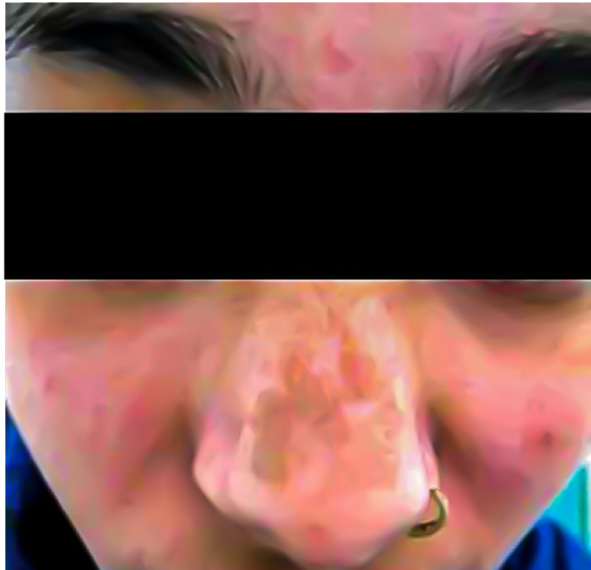
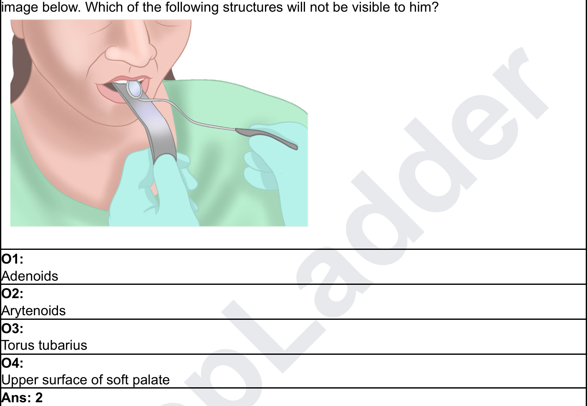

# Paper => INI CET Nov 2020  

<html><body><table><tr><td>Ques No: 1</td></tr><tr><td>Subject: Anatomy Topic:Head and Neck</td></tr><tr><td>Sub-Topic:</td></tr><tr><td></td></tr><tr><td>Medial lemniscus is a continuation of which of the following structures? 01:</td></tr><tr><td>Spinothalamic tract 02:</td></tr><tr><td>Spinocerebellar tract 03:</td></tr><tr><td>Spinotectal tract</td></tr><tr><td>04:</td></tr><tr><td>Fasciculus gracilis Ans: 4</td></tr></table></body></html>  

<html><body><table><tr><td>Ques No: 2 Subject: Anatomy Topic:NeuroAnatomy</td></tr><tr><td>Sub-Topic: Decussation of the superior cerebellar peduncle occurs at which level?</td></tr><tr><td>01:</td></tr><tr><td>Pons 02: Midbrain</td></tr><tr><td>03: Diencephalon</td></tr><tr><td>04: Medulla</td></tr><tr><td>Ans: 2</td></tr></table></body></html>  

<html><body><table><tr><td>Ques No: 3</td></tr><tr><td>Subject:Anatomy</td></tr><tr><td>Topic: Head and Neck</td></tr><tr><td>Sub-Topic:</td></tr><tr><td></td></tr><tr><td>All of the following are the contents of the carotid sheath except?</td></tr><tr><td>01:</td></tr><tr><td>Sympatheticchain</td></tr><tr><td>02:</td></tr><tr><td></td></tr><tr><td>Carotid artery</td></tr><tr><td>03:</td></tr></table></body></html>  

<html><body><table><tr><td>Internal jugular vein</td></tr><tr><td>04:</td></tr><tr><td>10th cranial nerve</td></tr><tr><td>Ans: 1</td></tr></table></body></html>  

<html><body><table><tr><td>Ques No: 4</td></tr><tr><td>Subject: Biochemistry Topic:Genetics</td></tr><tr><td>Sub-Topic:</td></tr><tr><td>What is true about the Hayflick limit?</td></tr><tr><td>01: Human cells can divide a finite number of times only</td></tr><tr><td>02:</td></tr><tr><td>Free radical oxidation level is unrestricted 03:</td></tr><tr><td>Telomerase activity is unrestricted</td></tr><tr><td>04:</td></tr><tr><td>RNA polymerase can function for a finite number of time only</td></tr><tr><td>Ans: 1</td></tr></table></body></html>  

<html><body><table><tr><td>Ques No: 5 Subject: Biochemistry Topic: Genetics Sub-Topic:</td></tr><tr><td>DNA methylation is not related to? 01:</td></tr><tr><td>Mismatch repair</td></tr><tr><td>02: Chromatin remodeling</td></tr><tr><td>03: DNA replication 04:</td></tr><tr><td>Gene silencing Ans: 3</td></tr></table></body></html>  

<html><body><table><tr><td>Ques No: 6</td></tr><tr><td>Subject: Biochemistry</td></tr><tr><td>Topic: Genetics</td></tr><tr><td>Sub-Topic:</td></tr><tr><td></td></tr><tr><td>The correct order of steps in a polymerase chain reaction (PCR) is:-</td></tr><tr><td>01:</td></tr><tr><td>Hybridization, annealing, elongation, denaturation 02:</td></tr></table></body></html>  

<html><body><table><tr><td>Elongation, denaturation, Hybridization, annealing,</td></tr><tr><td>03:</td></tr><tr><td>Denaturation, annealing, extension.</td></tr><tr><td>04:</td></tr><tr><td>Annealing, extension, denaturation</td></tr><tr><td>Ans:3</td></tr></table></body></html>  

<html><body><table><tr><td>Ques No: 7 Subject: Biochemistry</td></tr><tr><td>The maximum thermic effect is seen with a meal that has</td></tr><tr><td>01: Protein</td></tr><tr><td>02: Fat</td></tr><tr><td>03: Carbohydrates 04:</td></tr><tr><td>Mixed meal having all 3 in equal amount</td></tr><tr><td>Ans: 1</td></tr></table></body></html>  

<html><body><table><tr><td>Ques No: 8 Subject: Biochemistry Topic: Vitamins Sub-Topic:</td></tr><tr><td>01: Liver-skin-kidney</td></tr><tr><td>02: Skin-liver-kidney</td></tr><tr><td>03: Skin-kidney-liver</td></tr><tr><td>04:</td></tr><tr><td>Liver-kidney-skin</td></tr><tr><td>Ans: 2</td></tr></table></body></html>  

<html><body><table><tr><td>QuesNo: 9</td></tr><tr><td>Subject: Biochemistry</td></tr><tr><td>Topic: Vitamins</td></tr><tr><td>Sub-Topic:</td></tr><tr><td></td></tr><tr><td>Dicoumarol inhibits the action of vitamin K by? 01:</td></tr></table></body></html>  

<html><body><table><tr><td>Suicide inhibition</td></tr><tr><td>02:</td></tr><tr><td>Competitive inhibition</td></tr><tr><td>03:</td></tr><tr><td>Non-competitive inhibition</td></tr><tr><td>04:</td></tr><tr><td>Uncompetitive inhibition</td></tr><tr><td>Ans:2</td></tr></table></body></html>  

<html><body><table><tr><td>Ques No: 10 Subject:Biochemistry</td></tr><tr><td>Sub-Topic: Which of the following enzymes has the highest catalytic efficiency?</td></tr><tr><td>01: Km of an enzyme = 10 micromole and Kcat = 20 per sec</td></tr><tr><td>02: Km of an enzyme = 2000 nanomole and Kcat = 50 per sec</td></tr><tr><td>03: Km of an enzyme = 2 micromole and Kcat = 200 per sec</td></tr><tr><td>04:</td></tr><tr><td>Km of an enzyme = 4 micromole and Kcat = 200 per sec Ans: 3</td></tr></table></body></html>  

<html><body><table><tr><td>Ques No: 11 Subject: Forensic Medicine Topic: Indian Legal System & Medical Jurisprudence Sub-Topic: A patient comes to the casualty with life - threatening injuries. There was no time for taking consent. The doctor started doing life - saving procedures with all precautions, and despite best</td></tr><tr><td>efforts, the death of the patient occurred. The doctor is not responsible under which doctrine ? 01:</td></tr><tr><td>Res ipsa loquitor 02:</td></tr><tr><td>Doctrine of anticipation 03:</td></tr><tr><td>Doctrine of extended consent 04:</td></tr><tr><td>Doctrine of conjugated consent Ans: 2</td></tr><tr><td></td></tr></table></body></html>  

<html><body><table><tr><td>Ques No: 12</td></tr><tr><td>Subject: Forensic Medicine</td></tr></table></body></html>  

<html><body><table><tr><td>Topic:Sexual Jurisprudence Sub-Topic:</td></tr><tr><td>A 14 year old girl comes to the OPD with her mother. History of penovaginal penetration by the neighbor the consent for the same and says she does not want to be examined. As a medical officer, which of the following should you do ? 1. Document informed refusal 2. Do not inform the police 3.Counsel the mother and daughter 4.Examine with necessary force</td></tr><tr><td>5. Inform the police 01: 1,2,3 are true</td></tr><tr><td>02: 2,3,4 are true</td></tr><tr><td>03: 1,3,5 are true</td></tr><tr><td>04: 3,4,5 are true</td></tr><tr><td>Ans: 3</td></tr></table></body></html>  

<html><body><table><tr><td>Ques No: 13 Subject: Forensic Medicine Topic: ForensicThanatology Sub-Topic: What is the approximate age of a person in whom the medial end of the clavicle is fused and</td></tr><tr><td>also the sternum is completely fused 01:</td></tr><tr><td>18 years 02: 18-22 years</td></tr><tr><td>03: 22-25 years</td></tr><tr><td>04: >25 years</td></tr><tr><td>Ans: 4</td></tr></table></body></html>  

<html><body><table><tr><td>Ques No: 14</td></tr><tr><td>Subject: Forensic Medicine</td></tr><tr><td>Topic: Forensic Thanatology</td></tr><tr><td>Sub-Topic:</td></tr><tr><td>Which of the following is seen in freshwater drowning ?</td></tr><tr><td>A. Haemodilution</td></tr><tr><td>B. Hypokalemia</td></tr><tr><td>C. Hyponatremia</td></tr></table></body></html>  

<html><body><table><tr><td>D. Arrhythmia</td></tr><tr><td>01:</td></tr><tr><td>A,B,C,D</td></tr><tr><td>02:</td></tr><tr><td>A,B,C</td></tr><tr><td>03:</td></tr><tr><td>B,C,D</td></tr><tr><td>04:</td></tr><tr><td>A,C,D</td></tr><tr><td>Ans: 4</td></tr></table></body></html>  

<html><body><table><tr><td>Ques No: 15 Subject: Microbiology Topic: Systemic Bacteriology Sub-Topic:</td></tr><tr><td>A resident had a needle stick injury while dealing with a Hepatitis B-positive patient. Serology was done and HBsAg was negative and the Anti-HBs was >105 mlU/ml. What is the next step</td></tr><tr><td>of management? 01: A booster dose of the vaccine</td></tr><tr><td>02: Immunoglobulinwith full vaccination</td></tr><tr><td>03: Repeat the full course of vaccine</td></tr><tr><td>04: No treatment is required as he already has Hep B antibody titers from vaccination</td></tr><tr><td>Ans: 4</td></tr></table></body></html>  

<html><body><table><tr><td>Ques No: 16 Subject: Microbiology Topic: Systemic Bacteriology Sub-Topic:</td></tr><tr><td>GeneXpert defects mutations in which of the following genes ? 01:</td></tr><tr><td>InhA 02:</td></tr><tr><td>rpoB</td></tr><tr><td>03: KatG</td></tr><tr><td>04:</td></tr><tr><td></td></tr><tr><td>pncA Ans: 2</td></tr></table></body></html>  

<html><body><table><tr><td>Ques No: 17</td></tr></table></body></html>  

<html><body><table><tr><td>Subject:Microbiology</td></tr><tr><td>Topic: Immunology Sub-Topic:</td></tr><tr><td>Type IV hypersensitivity is due to ?</td></tr><tr><td>01:</td></tr><tr><td>Cell mediated response 02:</td></tr><tr><td>Cell mediated and antibody mediated response 03:</td></tr><tr><td>Antibody mediated response</td></tr><tr><td>04:</td></tr><tr><td>Innate response</td></tr><tr><td>Ans: 1</td></tr></table></body></html>  

<html><body><table><tr><td>Ques No: 18 Subject:Microbiology Topic: Virology Sub-Topic:</td></tr><tr><td>Specimen handling for molecular testing of SARS CoV 2 would require 01:</td></tr><tr><td>BSL 1 02:</td></tr><tr><td>BSL 2 03: BSL 3</td></tr><tr><td>04: BSL4</td></tr><tr><td>Ans: 2</td></tr></table></body></html>  

<html><body><table><tr><td>Ques No: 19 Subject: Microbiology Topic: Systemic Bacteriology</td></tr><tr><td>Sub-Topic:</td></tr><tr><td>All of the following is true regarding scrub typhus except : 01:</td></tr><tr><td>Transmitted by chiggers 02:</td></tr><tr><td>Lymphadenopathy is a feature</td></tr><tr><td>03: Produces NLF producing colonies in MacConkey agar</td></tr><tr><td>04:</td></tr><tr><td>Man is an accidental host</td></tr><tr><td></td></tr><tr><td>Ans: 3</td></tr><tr><td></td></tr><tr><td></td></tr></table></body></html>  

<html><body><table><tr><td>Ques No: 20</td></tr><tr><td>Subject: Microbiology Topic: SystemicBacteriology</td></tr><tr><td>Sub-Topic:</td></tr><tr><td>Pneumonia due to a gram - negative pleomorphic bacillus growing on chocolate agar which is</td></tr><tr><td>catalase and oxidase - positive is : 01:</td></tr><tr><td>E. coli 02:</td></tr><tr><td>Pseudomonas 03:</td></tr><tr><td>Haemophilus influenzae 04:</td></tr><tr><td>Actinomyces Ans: 3</td></tr></table></body></html>  

<html><body><table><tr><td>Ques No: 21 Subject: Microbiology Topic: Systemic Bacteriology Sub-Topic:</td></tr><tr><td>A 30 year old male presented to the OPD with painful genital ulcers. Which of the following can cause a painful ulcer on the glans penis ?</td></tr><tr><td>01: Syphilis</td></tr><tr><td>02: Chlamydia 03:</td></tr><tr><td>Chancroid 04:</td></tr><tr><td>Lymphogranuloma venereum Ans: 3</td></tr></table></body></html>  

<html><body><table><tr><td>Ques No: 22 Subject:Microbiology Topic: Virology</td></tr><tr><td>Sub-Topic: A patient presented with meningitis with a history of fever for 4 days and erythematous rashes</td></tr><tr><td>on the chest. There was no history of travel and tick bite. His CSF findings showed increased protein, normal glucose, mild lymphocytosis and few RBCs. Which of the following is the most likely organism to cause this clinical picture ?</td></tr><tr><td>01: West nile virus</td></tr><tr><td></td></tr><tr><td>02:</td></tr></table></body></html>  

<html><body><table><tr><td>Meningococci</td></tr><tr><td>03:</td></tr><tr><td>Strep pneumoniae</td></tr><tr><td>04:</td></tr><tr><td>Entero virus</td></tr><tr><td>Ans: 4</td></tr></table></body></html>  

<html><body><table><tr><td>Ques No: 23</td></tr><tr><td>Subject:Microbiology Topic: Virology</td></tr><tr><td>Sub-Topic:</td></tr><tr><td>Which of the following disease has the highest mortality once clinically manifested ?</td></tr><tr><td>01: Nipah</td></tr><tr><td>02: Rabies</td></tr><tr><td>03: Ebola</td></tr><tr><td>04:</td></tr><tr><td>Zika Ans: 2</td></tr></table></body></html>  

<html><body><table><tr><td>Ques No: 24 Subject: Microbiology Topic: General Microbiology Sub-Topic: In which of the following situations will you use a sanitizer ?</td></tr><tr><td>B. After examining the patient C. After touching the patient's surroundings D. Hands are visible solied</td></tr><tr><td>01: A, B & C only</td></tr><tr><td>02: A& B only</td></tr><tr><td>03: A,B, C & D</td></tr><tr><td>04: C & D only Ans: 1</td></tr><tr><td></td></tr></table></body></html>  

<html><body><table><tr><td>Ques No: 25</td></tr><tr><td>Subject: Microbiology</td></tr><tr><td>Topic: Systemic Bacteriology</td></tr></table></body></html>  

<html><body><table><tr><td colspan="3">Sub-Topic:</td></tr><tr><td colspan="3">Match the following E. coli with their respective pathogenesis</td></tr><tr><td>E.coli 1.ETEC 2.EIEC</td><td>Mechanism of action 1. Produces a heat - stable toxin and causes activation of guanylyl cyclase</td><td></td></tr><tr><td>3. EHEC 4. EPEC</td><td>2. Invades intestinal mucosal cells 3. Produces a toxin against vascular endothelium cells 4. Adheres to the mucosal surface and causes effacement of microvilli</td><td></td></tr><tr><td colspan="3">01:</td></tr><tr><td colspan="3">A-4, B-3, C-2, D-1 02:</td></tr><tr><td colspan="3">A-1, B-3, C-2, D-4 03:</td></tr><tr><td colspan="3">A-1, B-2, C-3, D-4 04:</td></tr><tr><td colspan="3">A-4, B-2, C-3, D-1 Ans: 3</td></tr></table></body></html>  

<html><body><table><tr><td>Ques No: 26 Subject: Microbiology</td></tr><tr><td>Topic: Mycology</td></tr><tr><td>Sub-Topic:</td></tr><tr><td>Galactomannan in serum is seen in :</td></tr><tr><td>1. Invasive aspergillosis</td></tr><tr><td>2. Systemic candidiasis 3. Mucormycosis</td></tr><tr><td>4. Cryptococcosis</td></tr><tr><td>01: 1&2 only</td></tr><tr><td>02: 1&3 only</td></tr><tr><td>03: 1 only</td></tr><tr><td>04:</td></tr><tr><td>1,2 & 3 only</td></tr><tr><td>Ans: 3</td></tr></table></body></html>  

<html><body><table><tr><td>Ques No: 27</td></tr><tr><td>Subject: Pathology</td></tr><tr><td>Topic: Gastrointestinal Tract</td></tr><tr><td>Sub-Topic:</td></tr></table></body></html>  

<html><body><table><tr><td>Which of the following is true about celiac disease?</td></tr><tr><td>01:</td></tr><tr><td>The most common cause of malnutrition in developing countries</td></tr><tr><td>02:</td></tr><tr><td>Can be diagnosed with CECT 03:</td></tr><tr><td>Improves with food rich in carbohydrates</td></tr><tr><td>04:</td></tr><tr><td>Increased riskof Gl lymphoma Ans:4</td></tr></table></body></html>  

<html><body><table><tr><td>SueseNe:Pathology Topic: Genetics Sub-Topic:</td></tr><tr><td>Which of the following is not true about stem cells? 01:</td></tr><tr><td>They can differentiate 02:</td></tr><tr><td>They can replicate</td></tr><tr><td>03: They can divide without any regulatory stimulus</td></tr><tr><td>04:</td></tr><tr><td>They can regenerate damaged tissues</td></tr><tr><td>Ans: 3</td></tr></table></body></html>  

<html><body><table><tr><td>Ques No: 29 Subject: Pathology Topic: Hematology: Red Blood Cells Sub-Topic: Which of the following is true regarding glucose -6-phosphate dehydrogenase deficiency?</td></tr><tr><td>01: Spectrin defect</td></tr><tr><td>02: Cells are spherical</td></tr><tr><td>03: Cells don't lyse in hypotonic solution 04:</td></tr><tr><td>Cells lyse in hypertonic solution Ans: 2</td></tr></table></body></html>  

<html><body><table><tr><td>Ques No: 30</td></tr><tr><td>Subject: Pathology</td></tr></table></body></html>  

<html><body><table><tr><td>Topic: Blood Banking and Transfusion Medicine Sub-Topic: A 24-year-old man met with an RTA and was brought to the casualty after 6 hours. His B.P. was 90/60 mm Hg, heart rate was 110/min, and Sp02 was 92%. A blood transfusion was done. After a few hours, the patient is febrile, and tachypneic, and starts bleeding from the IV and NG tube</td></tr><tr><td>sites. His SpO2 levels started falling. What could be the cause? 01: Transfusion reaction</td></tr><tr><td>02: Acute adrenal crisis</td></tr><tr><td>03: Fat embolism</td></tr><tr><td>04: Hemorrhagic shock</td></tr><tr><td>Ans: 1</td></tr><tr><td>Ques No: 31</td></tr><tr><td>Subject: Pathology Topic: Immunity Sub-Topic: All of the following conditions are related to the same core pathology except</td></tr><tr><td>01: Parkinson's disease</td></tr><tr><td>02: Alzheimers disease</td></tr><tr><td>03: Lewy body dementia</td></tr><tr><td>04: Multisystem atrophy</td></tr><tr><td>Ans: 2</td></tr><tr><td></td></tr><tr><td>Ques No: 32</td></tr></table></body></html>  

<html><body><table><tr><td>Ques No: 32 Subject: Surgery Topic: Gastrointestinal Surgery Sub-Topic:</td></tr><tr><td>A 65-year-old man presents with abdominal pain for the past 6 hours, BP- 89/50 mmHg, RR-</td></tr><tr><td>24/min, saturation 92% with 6 L of oxygen. The radiograph shows extraluminal air in the abdomen. Which of the following must be done before shifting this patient into the OT? 01:</td></tr><tr><td>Intubate the patient</td></tr><tr><td>02: Insert central venous catheter as initial IV access of choice</td></tr><tr><td></td></tr><tr><td>03:</td></tr><tr><td></td></tr></table></body></html>  

<html><body><table><tr><td>2 litresof crystalloid infusion</td></tr><tr><td>04:</td></tr><tr><td>Confirm the diagnosis with CECT</td></tr><tr><td>Ans:3</td></tr></table></body></html>  

<html><body><table><tr><td>Ques No: 33 Subject: Surgery Topic: Hepatobiliary Pancreatic Surgery Sub-Topic: ERCP is least useful in the diagnosis of</td></tr><tr><td>01: Recurrent pancreatitis</td></tr><tr><td>02: Unexplained jaundice</td></tr><tr><td>03: Periampullary mass</td></tr><tr><td>04: Acute Pancreatitis without choledocholithiasis</td></tr><tr><td>Ans: 4</td></tr></table></body></html>  

<html><body><table><tr><td>QuesNo:34 Subject:Surgery Topic:Others Sub-Topic:</td></tr><tr><td>Which of the following is a correct statement regarding retroperitoneal trauma?</td></tr><tr><td>01: All zone 1 injury to be treated conservatively</td></tr><tr><td>02: Zone 3 injury whether blunt or penetrative should always be explored</td></tr><tr><td>03: Zone 2 injury with expanding hematoma should be treated surgically</td></tr><tr><td>04: Mattox maneuver is when the ascending colon is mobilized to the right to visualize the Aorta</td></tr><tr><td>Ans: 2</td></tr></table></body></html>  

<html><body><table><tr><td>QuesNo:35</td></tr><tr><td>Subject:Surgery</td></tr><tr><td>Topic:Others</td></tr><tr><td>Sub-Topic:</td></tr><tr><td>eFAST is least helpful in diagnosing which of the following conditions?</td></tr></table></body></html>  

<html><body><table><tr><td>01:</td></tr><tr><td>Pericardial Effusion</td></tr><tr><td>02:</td></tr><tr><td>Pneumothorax</td></tr><tr><td>03:</td></tr><tr><td>Retroperitoneal hematoma</td></tr><tr><td>04:</td></tr><tr><td>Renal injury</td></tr><tr><td>Ans: 3</td></tr></table></body></html>  

<html><body><table><tr><td>Ques No: 36</td></tr><tr><td>Topic: Endocrine Surgery Sub-Topic: A patient with unilateral breast cancer is started on tamoxifen. This will increase the risk of?</td></tr><tr><td>01:</td></tr><tr><td>Ovarian cancer 02:</td></tr><tr><td>Endometrial cancer</td></tr><tr><td>03: Breast cancer onotherside</td></tr><tr><td>04:</td></tr><tr><td>Cervical cancer Ans: 2</td></tr></table></body></html>  

<html><body><table><tr><td>Ques No: 37 e Subject: Surgery</td></tr><tr><td>Which of the following is not an adverse effect seen after a massive blood transfusion?</td></tr><tr><td>01: Hypocalcemia</td></tr><tr><td>02: Hypercalcemia</td></tr><tr><td>03:</td></tr><tr><td>Hypokalemia</td></tr><tr><td>04:</td></tr><tr><td>Hyperkalemia Ans: 2</td></tr></table></body></html>  

<html><body><table><tr><td>Ques No: 38</td></tr><tr><td>Subject: Surgery</td></tr></table></body></html>  

<html><body><table><tr><td>Topic:EndocrineSurgery</td></tr><tr><td>Sub-Topic:</td></tr><tr><td>Which among the following is correct regarding adequate thyroid FNAC sampling?</td></tr><tr><td>01:</td></tr><tr><td>6 follicular clusters each with 10 cells each</td></tr><tr><td>02:</td></tr><tr><td>3 follicular clusters with 10-15 cells each</td></tr><tr><td>03:</td></tr><tr><td>10 follicular cell clusters with 6-8 cells each</td></tr><tr><td>04:</td></tr><tr><td>12 follicular cell clusters with 10-12 cells each</td></tr><tr><td>Ans: 1</td></tr></table></body></html>  

Ques No: 39   
Subject: Surgery   
Topic: Cardiothoracic Vascular Surgery   
Sub-Topic:  

What is the most likely diagnosis of the lesion shown in the image below?  

  

<html><body><table><tr><td>01:</td></tr><tr><td>Arterial insufficiency</td></tr><tr><td>02:</td></tr><tr><td>Neuropathic ulcer</td></tr><tr><td>03:</td></tr><tr><td>Venous ulcer 04:</td></tr><tr><td>Tuberculous ulcer</td></tr><tr><td>Ans: 2</td></tr></table></body></html>  

<html><body><table><tr><td>Ques No: 40 Subject: Surgery Topic: Cardiothoracic Vascular Surgery</td></tr><tr><td>Sub-Topic: A 35-year-old chronic smoker presents with bluish toe discoloration and intermittent</td></tr><tr><td>claudication. Which of the following will be the next appropriate investigation in this patient?</td></tr><tr><td>01: CT Angiography</td></tr><tr><td>02: MR Angiography 03:</td></tr><tr><td>Digital subtraction angiography 04:</td></tr><tr><td>Duplex scan</td></tr><tr><td></td></tr><tr><td>Ans: 4</td></tr></table></body></html>  

<html><body><table><tr><td>Ques No: 41 Subject: Surgery</td></tr><tr><td>Topic: Others Sub-Topic:</td></tr><tr><td>In e-FAST which of the following body part is included apart from the abdomen?</td></tr><tr><td>01: Pelvic Cavity</td></tr><tr><td>02: Peripheral vessels</td></tr><tr><td>03: Thoracic cavity 04:</td></tr><tr><td>Dural and subdural spaces</td></tr><tr><td>Ans: 3</td></tr></table></body></html>  

<html><body><table><tr><td>Ques No: 42 Subject:Surgery Topic: Cardiothoracic Vascular Surgery Sub-Topic:</td></tr><tr><td>A bus conductor was diagnosed with varicose veins. On examination, skin eczema and lipodermatosclerosis were noted. According to the CEAP classification system, He would be classified as</td></tr><tr><td>01: C1</td></tr><tr><td>02:</td></tr></table></body></html>  

<html><body><table><tr><td>C2</td></tr><tr><td>03:</td></tr><tr><td>C3</td></tr><tr><td>04:</td></tr><tr><td>C4</td></tr><tr><td>Ans: 4</td></tr></table></body></html>  

<html><body><table><tr><td>Ques No: 43 Subject:Surgery Topic: EndocrineSurgery</td></tr><tr><td>A 50-year-old female patient presents with a 4 cm*3 cm irregular mass in the upper outer quadrant of the right breast, which is not fixed to the skin or the chest wall. A lymph node of 2cm is palpated in the right axilla. No mass is palpated in the opposite breast. Which of the following investigations would you perform in this patient? A.Bilateral Mammography</td></tr><tr><td>B. PET Scan C. Biopsy of the breast mass D. USG guided biopsy of the lymph node</td></tr><tr><td>01: A, B,C& D</td></tr><tr><td>02: A, B&C</td></tr><tr><td>03: A, C, & D 04:</td></tr><tr><td>A&C Ans: 3</td></tr></table></body></html>  

<html><body><table><tr><td>QuesNo: 44 Subject: Surgery</td></tr><tr><td>Topic: Gastrointestinal Surgery Sub-Topic:</td></tr><tr><td>Which of the following is true about the Tillaux sign?</td></tr><tr><td></td></tr><tr><td>01:</td></tr><tr><td>Mass is felt in the periumbilical region</td></tr><tr><td>02:</td></tr><tr><td>Mass is brilliantly transilluminant</td></tr><tr><td>03:</td></tr><tr><td>Mass is mobile perpendicular to mesentery attachment line</td></tr><tr><td></td></tr><tr><td>04:</td></tr><tr><td>Fluctuation is positive</td></tr><tr><td></td></tr><tr><td>Ans: 3</td></tr></table></body></html>  

<html><body><table><tr><td>Ques No: 45</td></tr><tr><td>Subject: Surgery Topic: Gastrointestinal Surgery</td></tr><tr><td>Sub-Topic:</td></tr><tr><td>A child is diagnosed with congenital hypertrophic pyloric stenosis, which among the following can be seen in this child? A. Bilious vomiting</td></tr><tr><td>B. Visible peristalsis from right to left C. Hypochloremia and hypokalemia</td></tr><tr><td>D. Metabolic alkalosis 01:</td></tr><tr><td>B,C and D 02: C and D only</td></tr><tr><td>03:</td></tr><tr><td>A, B and D 04:</td></tr><tr><td>Ans: 2</td></tr><tr><td></td></tr><tr><td>A, B, C, and D</td></tr></table></body></html>  

Ques No: 46   
Subject: Anatomy   
Topic: Thorax   
Sub-Topic:   
Given is a model of the embryological development of the heart. Which structure develops from   
the area marked as “A”?   
Ques No: 47   
Subject: Anatomy   
Topic: Lower Limb   
Sub-Topic:   
A muscle is attached to the area marked in the given Image. What is the action of this muscle   
on the hip joint?   
Ques No: 48   
Subject: Anatomy   
Topic: Head and Neck   
Sub-Topic:   
Which of the following arteries passes in close proximity to the area marked by the arrow in the   
given image?   
O1:   
Internal carotid artery   
O2:   
Middle meningeal artery   
O3:   
Anterior cerebral artery   
O4:   
Deep temporal artery   
Ans: 2   
Ques No: 50   
Subject: Anatomy   
Topic: Head and Neck   
Sub-Topic:   
Identify the foramen marked in the image below:-   
Ques No: 52   
Subject: Anatomy   
Topic: Head and Neck   
Sub-Topic:  

  

  

  

<html><body><table><tr><td>QuesNo:49 Subject:Anatomy Topic: Upper Limb Sub-Topic: Which of the following muscles is attached to the area marked in the image below?</td></tr></table></body></html>  

<html><body><table><tr><td>Abductor pollicis longus</td></tr><tr><td>02:</td></tr><tr><td>Palmar interossei</td></tr><tr><td>03:</td></tr><tr><td>Opponens pollicis</td></tr><tr><td>04:</td></tr><tr><td>Flexor pollicis brevis</td></tr><tr><td>Ans: 3</td></tr></table></body></html>  

  

<html><body><table><tr><td></td></tr><tr><td>Ques No: 51</td></tr></table></body></html>  

<html><body><table><tr><td>Subject: Anatomy</td></tr><tr><td>Topic: Upper Limb Sub-Topic:</td></tr><tr><td>Which of the following muscles is not involved in the overhead abduction of the arm?</td></tr><tr><td>01:</td></tr><tr><td>Serratus anterior</td></tr><tr><td>02: Deltoid</td></tr><tr><td>03:</td></tr><tr><td>Trapezius</td></tr><tr><td>04: Pectoralis major</td></tr></table></body></html>  

All of the following nerves are involved in the movement of the eyeball except:  

  

<html><body><table><tr><td></td></tr><tr><td>Ans:1</td></tr></table></body></html>  

<html><body><table><tr><td>Ques No: 53</td></tr><tr><td>Subject: Anatomy</td></tr><tr><td>Topic: Upper Limb</td></tr><tr><td>Sub-Topic:</td></tr><tr><td>The middle radioulnar joint is an example of a:</td></tr><tr><td>01: Plane synovial</td></tr><tr><td>02: Primary cartilaginous</td></tr><tr><td>03:</td></tr><tr><td>Secondary cartilaginous 04:</td></tr><tr><td>Fibrous joint</td></tr></table></body></html>  

<html><body><table><tr><td>Ques No: 54 Subject:Anatomy Topic: Thorax</td></tr><tr><td>Sub-Topic: Identify the level of the cross-section shown in the image below:-</td></tr><tr><td></td></tr><tr><td>01:</td></tr><tr><td>T1-T2</td></tr><tr><td>02:</td></tr><tr><td>T2-T3</td></tr><tr><td>03:</td></tr><tr><td>T3-T4</td></tr><tr><td>04:</td></tr><tr><td></td></tr><tr><td>T4-T5</td></tr><tr><td>Ans: 3</td></tr></table></body></html>  

<html><body><table><tr><td>Ques No: 55</td></tr></table></body></html>  

<html><body><table><tr><td>Subject:Dermatology Topic: Sexually Transmitted Infections Sub-Topic:</td></tr><tr><td>A female patient presents with active genital warts with a history of recurrence, but her husband does not have it. What advice will you give to prevent transmission?</td></tr><tr><td>01: Give continuous prophylaxis to the patient</td></tr><tr><td>02: Give prophylactic anti-virals to the husband</td></tr><tr><td>03: Give anti-virals whenever active lesions are present</td></tr><tr><td>04:</td></tr><tr><td>Don't involve in intercourse when active lesions are present Ans: 4</td></tr></table></body></html>  

Ques No: 56   
Subject: Dermatology   
Topic: Cutaneous Infections   
Sub-Topic:  

A rose gardener with a history of thorn priok presents with the following lesions. What is the possible causative agent?  

<html><body><table><tr><td></td><td></td><td></td></tr><tr><td colspan="2"></td></tr></table></body></html>  

O1:   
O2:   
Sporothrix schenkii   
Ques No: 57   
Subject: Dermatology   
Topic: Cutaneous Infections   
Sub-Topic:  

<html><body><table><tr><td>03:</td></tr><tr><td>Stronglyoides stercoralis</td></tr><tr><td>04:</td></tr><tr><td>Staphylococcus aureus</td></tr><tr><td>Ans: 2</td></tr></table></body></html>  

A 40-year-old woman who presented with complaints of fever and joint pain developed the following lesion on her nose after a few days of taking NSAIDs. What is your diagnosis?  

  

<html><body><table><tr><td>01: Dengue</td></tr><tr><td>02:</td></tr><tr><td>Chikungunya 03:</td></tr><tr><td>Melasma</td></tr><tr><td>04:</td></tr><tr><td>Fixed drug eruption</td></tr><tr><td>Ans: 2</td></tr></table></body></html>  

<html><body><table><tr><td>QuesNo: 58</td></tr><tr><td>Subject:Dermatology</td></tr><tr><td>Topic: Miscellaneous Disorders</td></tr><tr><td>Sub-Topic:</td></tr><tr><td></td></tr><tr><td>The given condition is caused by which drug ?</td></tr></table></body></html>  

  

Ques No: 59   
Subject: Dermatology   
Topic: Immunobullous Disorders   
Sub-Topic:  

A child presents to OPD with tense bullae over the torso. A biopsy of the lesion showed a subepidermal level of blistering and neutrophil infiltration. What is the drug of choice?  

  

<html><body><table><tr><td></td></tr><tr><td>01:</td></tr><tr><td>Rituximab</td></tr><tr><td>02:</td></tr><tr><td>Dapsone</td></tr><tr><td>03:</td></tr><tr><td>Cyclosporine</td></tr><tr><td>04:</td></tr><tr><td>Azathioprine</td></tr><tr><td>Ans: 2</td></tr></table></body></html>  

<html><body><table><tr><td>Ques No: 60 Subject: Dermatology Topic: Papulosquamous Disorders Sub-Topic:</td></tr><tr><td>A patient with a known case of chronic plaque psoriasis with more than 50% skin involvement presents to you. Which of the following will you not recommend? 01:</td></tr><tr><td>Oral methotrexate 02:</td></tr><tr><td>NB UVB 03: Oral steroids</td></tr><tr><td>04: Oral cyclosporine</td></tr><tr><td>Ans: 3</td></tr></table></body></html>  

Ques No: 61   
Subject: ENT   
Topic: Larynx   
Sub-Topic:   
A patient underwent a total laryngectomy for laryngeal cancer. Identify the modality of voice production in this patient shown in the image given below.  

  

<html><body><table><tr><td>Ques No: 62 Subiect:ENT Sub-Topic:</td></tr><tr><td>A patient complaining of vertigo without hearing loss has consulted an ENT surgeon. The surgeon performs a diagnostic maneuver and cautiously performs a therapeutic maneuver. What is the diagnostic maneuver?</td></tr><tr><td>01: Hampton's maneuver</td></tr><tr><td>02:</td></tr><tr><td>Dix-Hallpikemaneuver</td></tr><tr><td>03:</td></tr><tr><td>Epley's maneuver</td></tr><tr><td>04: Simon's maneuver</td></tr><tr><td>Ans: 2</td></tr></table></body></html>  

Ques No: 63 Subject: ENT Topic: Pharynx Sub-Topic:  

A senior resident in the hospital is performing the following clinical examination as shown in the  

  

Ques No: 64   
Subject: ENT   
Topic: Nose and Paranasal Sinuses   
Sub-Topic:   
The radiograph is shown below is done for a better assessment of the frontal sinus. What is the   
common name of this view?   
Ques No: 65   
Subject: ENT   
Topic: Nose and Paranasal Sinuses   
Sub-Topic:   
Given below is the endoscopic view of the right nasal cavity. Identify the marked structure ?  

  

  

<html><body><table><tr><td>Ques No: 66 Subject: ENT Topic: Ear Sub-Topic: Identify the correct sequence of the auditory pathways:</td></tr><tr><td>A. Superior Olivary nucleus B. Cochlear Nucleus C. Inferior Colliculi D. Lateral lemniscus E. Medial geniculate ganglion</td></tr><tr><td>01:</td></tr><tr><td>ABCDE 02: BADCE</td></tr><tr><td>03: BACDE</td></tr><tr><td>04:</td></tr></table></body></html>  

<html><body><table><tr><td>BAEDC</td></tr><tr><td>Ans: 2</td></tr></table></body></html>  

<html><body><table><tr><td>Ques No: 67</td></tr><tr><td>Subject:Medicine Topic: Hematology</td></tr><tr><td>Sub-Topic:</td></tr><tr><td>Which of the following is the drug of choice for hairy cell leukaemia?</td></tr><tr><td>01: Rituximab</td></tr><tr><td>02: Vemurafenib</td></tr><tr><td>03: Cladribine</td></tr><tr><td></td></tr><tr><td>04:</td></tr><tr><td>Interferon-alpha Ans: 3</td></tr></table></body></html>  

Ques No: 68 Subject: Medicine Topic: Infections Sub-Topic:  

Following is a graphic representation of a patient admitted in the medicine ward with a fever. What could be the possible diagnosis?  

  

<html><body><table><tr><td>01:</td></tr><tr><td>Cerebral malaria</td></tr><tr><td>02:</td></tr><tr><td>Brucellosis</td></tr><tr><td>03:</td></tr><tr><td>Leptospirosis</td></tr><tr><td>04:</td></tr><tr><td>Typhoid</td></tr><tr><td>Ans: 3</td></tr></table></body></html>  

<html><body><table><tr><td>QuesNo:69 Subject:Medicine Topic:Endocrinology</td></tr><tr><td>A diabetic nephropathy patient is an ideal candidate for a renal graf transplant. Which of the following statements is true? 01:</td></tr><tr><td>The survival rate of graft is 95% in the first year</td></tr><tr><td>02: The transplantation is cost effective after the second transplant year 03:</td></tr><tr><td>The life expectancy is doubled in a diabetic patient with renal transplant 04:</td></tr><tr><td>The treatment of chronic rejection has improved over the last 10 years</td></tr><tr><td>Ans: 2</td></tr></table></body></html>  

Ques No: 70   
Subject: Medicine   
Topic: Endocrinology   
Sub-Topic:   
A diabetic patent walks into your clinic and does “namaste”. The image is given below. What   
could be the probable cause?  

  

Ques No: 71 Subject: Medicine Topic: Neurology Sub-Topic:  

<html><body><table><tr><td>Which part of the internal capsule is affected in hemiplegia due to ischaemic stroke?</td></tr><tr><td>01:</td></tr><tr><td>Retrolentiform</td></tr><tr><td>02:</td></tr><tr><td>Sublentiform</td></tr><tr><td>03:</td></tr><tr><td>Anteriorlimb</td></tr><tr><td>04:</td></tr><tr><td>Posterior limb</td></tr><tr><td>Ans: 4</td></tr></table></body></html>  

<html><body><table><tr><td>Ques No: 72 Subject: Physiology Topic: Cardiovascular System Sub-Topic:</td></tr><tr><td>A 65-year-old patient visits his family practitioner for a yearly examination. On examination, his BP was 190/100 mm Hg. His pulse pressure was 90 mm Hg. What would have decreased resulting in this increase in pulse pressure?</td></tr><tr><td>01: Myocardial contractility 02:</td></tr><tr><td>Stroke volume 03:</td></tr><tr><td>Arterial wall compliance 04:</td></tr><tr><td>Cardiac output Ans: 3</td></tr></table></body></html>  

<html><body><table><tr><td>Ques No: 73 Subject: Physiology Topic: Nerve Muscle Physiology Sub-Topic:</td></tr><tr><td>Transcutaneous electric nerve stimulation is used to reduce pain. What is the mechanism behind this? 01:</td></tr><tr><td>Central inhibition 02:</td></tr><tr><td>Desensitization 03:</td></tr><tr><td>Gate control theory</td></tr><tr><td>04:</td></tr><tr><td>Descendinginhibition</td></tr><tr><td>Ans: 3</td></tr></table></body></html>  

<html><body><table><tr><td>Ques No: 74 Subject: Physiology</td></tr><tr><td>Topic: General Physiology Sub-Topic:</td></tr><tr><td>A neuron receives 400 inputs from 150 sensory neurons. This is an example of?</td></tr><tr><td>01:</td></tr><tr><td>Divergence 02:</td></tr><tr><td>Convergence</td></tr><tr><td>03:</td></tr><tr><td>Feedback inhibition</td></tr><tr><td>04:</td></tr><tr><td></td></tr><tr><td>Feedforwardexcitation</td></tr><tr><td>Ans: 2</td></tr></table></body></html>  

<html><body><table><tr><td>Ques No: 75 Subiect: Gynaecology & Obstetics Sub-Topic:</td></tr><tr><td>01:</td></tr><tr><td>More than 65 years old 02:</td></tr><tr><td>Less than 21 years, old 03: 21 to65yearold females</td></tr><tr><td>04:</td></tr><tr><td>Teenagers Ans: 3</td></tr></table></body></html>  

<html><body><table><tr><td>Ques No: 76 Subject: Gynaecology & Obstetrics Topic: Gynecology Sub-Topic:</td></tr><tr><td>Oral contraceptives act by all of the following mechanisms except:</td></tr><tr><td>01: Inhibit implantation</td></tr><tr><td>02:</td></tr><tr><td></td></tr><tr><td>Cervical mucus thickening</td></tr><tr><td></td></tr><tr><td>03: Inhibitovulation</td></tr></table></body></html>  

<html><body><table><tr><td>04:</td></tr><tr><td></td></tr><tr><td>Increase GnRH release Ans: 4</td></tr></table></body></html>  

<html><body><table><tr><td>Ques No: 77</td></tr><tr><td>Subject: Physiology</td></tr><tr><td>Topic: General Physiology</td></tr><tr><td>Sub-Topic:</td></tr><tr><td>Intercellular communication in eukaryotes is by?</td></tr><tr><td>01: Lysosome</td></tr><tr><td>02: Peroxisome</td></tr><tr><td>03:</td></tr><tr><td>Exosome 04:</td></tr><tr><td>Genome</td></tr><tr><td>Ans: 3</td></tr></table></body></html>  

<html><body><table><tr><td>Ques No: 78 Subject: Gynaecology& Obstetrics Topic: Gynecology Sub-Topic: A 30-year-old woman visits an infertility clinic. She has a regular 28-day cycle. How should she be evaluated?</td></tr><tr><td>01:</td></tr><tr><td>Serum progesterone on 14 02:</td></tr><tr><td>Serumprogesteroneday21 03: Serum LH on day 14</td></tr><tr><td>04: Serum LH on day 21</td></tr><tr><td>Ans: 2</td></tr></table></body></html>  

<html><body><table><tr><td>Ques No: 79</td></tr><tr><td>Subject: Physiology</td></tr><tr><td>Topic: General Physiology</td></tr><tr><td>Sub-Topic:</td></tr><tr><td>In negative feedback, feedback gain of infinity is seen in which of the following?</td></tr><tr><td>01:</td></tr><tr><td></td></tr><tr><td>Blood volume control by kidney</td></tr><tr><td></td></tr></table></body></html>  

<html><body><table><tr><td>02:</td></tr><tr><td>Temperature control in the hypothalamus</td></tr><tr><td>03:</td></tr><tr><td>BP control by baroreceptors</td></tr><tr><td>04:</td></tr><tr><td>Infinite gain is not possible</td></tr><tr><td>Ans:1</td></tr></table></body></html>  

<html><body><table><tr><td>Ques No: 80 Subject: Physiology Topic: Gastrointestinal System</td></tr><tr><td>Sub-Topic:</td></tr><tr><td>Least frequency of slow waves is seen in: 01:</td></tr><tr><td>Duodenum 02:</td></tr><tr><td>lleum</td></tr><tr><td>03: Jejunum</td></tr><tr><td>04: Stomach</td></tr><tr><td>Ans: 4</td></tr></table></body></html>  

<html><body><table><tr><td>Ques No: 81 Subject: Physiology Topic:ExcretorySystem Sub-Topic: As filtrate flows through PCT, the concentration of all of the following decreases except:</td></tr><tr><td>01: Aminoacid</td></tr><tr><td>02: Glucose</td></tr><tr><td>03: Chloride</td></tr><tr><td>04: Bicarbonate</td></tr><tr><td>Ans: 3</td></tr></table></body></html>  

<html><body><table><tr><td>QuesNo:82</td></tr><tr><td>Subject:Physiology</td></tr><tr><td>Topic: NerveMusclePhysiology</td></tr><tr><td>Sub-Topic:</td></tr><tr><td></td></tr><tr><td>Calculate the respiratory quotient (RQ) in a patient with 50 kg body weight,if the CO2 exhaled</td></tr></table></body></html>  

<html><body><table><tr><td>is 200 ml/min and O2 consumed is 250 ml/min.</td></tr><tr><td>01:</td></tr><tr><td>0.8</td></tr><tr><td>02:</td></tr><tr><td>1</td></tr><tr><td>03:</td></tr><tr><td>1.25</td></tr><tr><td>04:</td></tr><tr><td>1.5</td></tr><tr><td>Ans:1</td></tr></table></body></html>  

<html><body><table><tr><td>Ques No: 83 Subject: Physiology Topic: Endocrine and Reproductive System Sub-Topic: Which of the following is not a cause of secondary hyperparathyroidism?</td></tr><tr><td>01: Parathyroid adenoma</td></tr><tr><td>02: Lithium intake</td></tr><tr><td>03: Vitamin D deficiency 04:</td></tr><tr><td>Chronic kidney disease Ans: 1</td></tr></table></body></html>  

<html><body><table><tr><td>Ques No: 84 Subject:Physiology Topic: Nerve MusclePhysiology Sub-Topic:</td></tr><tr><td>Which of the following statements is true about skeletal muscle contraction? 1. Extracellular Ca2+ is not essential for contraction 2. Ca2+ is released from mitochondria</td></tr><tr><td>3. Ca2+ is released from the sarcoplasmic reticulum 4. Voltage-gated Ca2+ channels on sarcolemma have no role in EC coupling 01:</td></tr><tr><td>2.3,4 02:</td></tr><tr><td>3 only 03:</td></tr><tr><td>1,2,4 04: 1.3,4</td></tr><tr><td>Ans: 2</td></tr></table></body></html>  

<html><body><table><tr><td>Ques No: 85 Subject: Physiology</td></tr><tr><td>Topic: Respiratory System Sub-Topic: Which of the following increases in COPD? 1． FRC 2.TLC</td></tr><tr><td>3. VC 4. FEV1/FVC 01:</td></tr><tr><td>1 only 02:</td></tr><tr><td>1 and 4 03:</td></tr><tr><td>1 and 3 04:</td></tr><tr><td>1 and 2 Ans: 4</td></tr></table></body></html>  

<html><body><table><tr><td>Ques No: 86 Subject: Medicine Topic: Pulmonology Sub-Topic:</td></tr><tr><td>Which of the following is false about mycoplasma pneumonia? 01: Responds well to amoxiclav</td></tr><tr><td>02: Antibodies are useful in diagnosis infiltrates</td></tr><tr><td>03: Chest X-ray shows bilateral infiltrates</td></tr><tr><td>04: Can be cultured in a cell-free medium</td></tr><tr><td>Ans: 1</td></tr></table></body></html>  

<html><body><table><tr><td>Ques No: 87</td></tr><tr><td>Subject: Medicine</td></tr><tr><td>Topic:Endocrinology</td></tr><tr><td>Sub-Topic:</td></tr><tr><td>The serum electrolyte values of a patient weighing 60 kg are given below. Calculate the sodium</td></tr><tr><td>deficit in the patent. pH: 7.42, Na+: 120 mEq/L, serum Cl-: 90 mEq/L.</td></tr><tr><td>01:</td></tr><tr><td>20 mEq</td></tr><tr><td></td></tr><tr><td>02:</td></tr></table></body></html>  

<html><body><table><tr><td>200 mEq</td></tr><tr><td>03:</td></tr><tr><td></td></tr><tr><td>400 mEq</td></tr><tr><td>04: 720 mEq</td></tr><tr><td>Ans: 4</td></tr></table></body></html>  

<html><body><table><tr><td>Ques No: 88</td></tr><tr><td>Subject:Medicine Topic: Cardiology</td></tr><tr><td>Sub-Topic:</td></tr><tr><td>In a patient with non-ST-elevation myocardial infarction (NSTEMI), al the following can be used</td></tr><tr><td>fortreatmentexcept? 01:</td></tr><tr><td>Aspirin 02:</td></tr><tr><td>Clopidogrel 03:</td></tr><tr><td>Streptokinase</td></tr><tr><td>04:</td></tr><tr><td>Prasugrel Ans: 3</td></tr></table></body></html>  

<html><body><table><tr><td>Ques No: 89 Subject: Medicine Topic: Nephrology / Kidney Disease Sub-Topic:</td></tr><tr><td>Components of the MELD (2016) score are all except?</td></tr><tr><td>01: Bilirubin</td></tr><tr><td>02: Prothrombin time</td></tr><tr><td>03: Albumin 04:</td></tr><tr><td>Creatinine Ans: 3</td></tr></table></body></html>  

<html><body><table><tr><td>QuesNo:90</td></tr><tr><td>Subject:Medicine</td></tr><tr><td>Topic:Pulmonology</td></tr><tr><td>Sub-Topic:</td></tr><tr><td></td></tr><tr><td></td></tr><tr><td>In the given acid-base nomogram diagram, areas marked A and D indicated which of the</td></tr></table></body></html>  

following conditions?  

  

Ques No: 91   
Subject: Medicine   
Topic: Cardiology   
Sub-Topic:   
A patient comes with palpitation to ER. His pulse -180/min and BP-70mm of Hg systolic. ECG   
shows narrow QRS complex tachycardia with regular heart rate. What is the next step in   
management?   
O1:  

<html><body><table><tr><td>DC cardioversion</td></tr><tr><td>02:</td></tr><tr><td>Adenosine</td></tr><tr><td>03:</td></tr><tr><td>Valsalva Maneuver</td></tr><tr><td>04:</td></tr><tr><td>Verapamil</td></tr><tr><td>Ans: 1</td></tr></table></body></html>  

<html><body><table><tr><td>Ques No: 92</td></tr><tr><td>Subject: Medicine Topic: Cardiology</td></tr><tr><td>Sub-Topic:</td></tr><tr><td>A patient comes to the hospital within 3 hours of the onset of chest pain. ECG revealed ST depression in anterior chest leads and T wave inversion. She could be best managed by?</td></tr><tr><td>01: PCI</td></tr><tr><td>02: Thrombolysiswithalteplase</td></tr><tr><td>03: Prophylaxis for arrhythmia</td></tr><tr><td>04: Aspirin with heparin</td></tr><tr><td>Ans: 4</td></tr></table></body></html>  

<html><body><table><tr><td>Ques No: 93 Subject: Medicine Topic: GIT Sub-Topic: A patient presented with massive abdominal swelling. Paracentesis fluid was sent for lab</td></tr><tr><td>analysis and results show serum protein to be 3g/dL and ascitic fluid protein to be 1g/dL. What is the likely diagnosis? 01:</td></tr><tr><td>Congestive heart failure 02:</td></tr><tr><td>Early Budd Chiari syndrome 03: Late Budd Chiari syndrome</td></tr><tr><td>04: Tuberculosis</td></tr><tr><td>Ans: 3</td></tr></table></body></html>  

<html><body><table><tr><td>Ques No: 94</td></tr><tr><td>Subject: Medicine</td></tr></table></body></html>  

<html><body><table><tr><td colspan="3">Topic: Cardiology Sub-Topic: 1. A 13-year-old boy collapsed while playing football. ECG showed V5, and V6 inversion and prominent inverted T-waves. 2D echocardiography showed the septal anterior motion</td></tr><tr><td colspan="3">of the mitral valve leaflet. Which of the following features will be seen on clinical examination and which of the following are true regarding the management?</td></tr><tr><td>Clinical findings</td><td>Management</td><td></td></tr><tr><td>1. Pulsus bisferiens</td><td>1. Beta-blockers are given</td><td></td></tr><tr><td>1. Pulsus alternans</td><td>1.</td><td>Beta-blockers are contraindicated</td></tr><tr><td>1. Ejection systolic murmur</td><td>1. ICD is indicated 1.</td><td></td></tr><tr><td>1. Murmur increases on standing</td><td>ICD is contraindicated</td><td></td></tr><tr><td>1. Murmur decreases on standing</td><td></td><td></td></tr><tr><td colspan="3">01:</td></tr><tr><td colspan="3">1 & 3, a, c, d</td></tr><tr><td colspan="3">02: 2 & 4, b, c, e 03:</td></tr><tr><td colspan="3">1 & 3, a, d</td></tr><tr><td colspan="3">04: 2 & 4, b, e Ans: 1</td></tr></table></body></html>  

<html><body><table><tr><td>Ques No: 95 Subject: Medicine Topic: Cardiology Sub-Topic:</td></tr><tr><td>Correct sequence after p wave: A-'a' wave B - 1st heart sound C - Rapid filling of ventricles</td></tr><tr><td>D -'t' wave 01:</td></tr><tr><td>ABCD</td></tr><tr><td>02: ABDC 03:</td></tr><tr><td>CABD 04:</td></tr><tr><td>ACBD Ans: 2</td></tr></table></body></html>  

<html><body><table><tr><td></td></tr><tr><td>Ques No: 96</td></tr></table></body></html>  

<html><body><table><tr><td>Subject:Medicine Topic: Liver</td></tr><tr><td>Sub-Topic: Which of the following are true regarding the KF ring? 1. Seen in all patients with neurological involvement 2. Is pathognomonic for Wilson's disease</td></tr><tr><td>3. Resolves with desferrioxamine 4. Seen in all patients with hepatic involvement 5. Seen in superior and inferior pole of Descemet's membrane</td></tr><tr><td>01:</td></tr><tr><td>1, 2 and 5 only 02:</td></tr><tr><td>1 and 5 only 03:</td></tr><tr><td>1,2,3, 4 and 5 04:</td></tr><tr><td>2,3,4 and 5 only Ans: 2</td></tr></table></body></html>  

<html><body><table><tr><td>Ques No: 97 Subject: Gynaecology & Obstetrics Topic: Obstetrics Sub-Topic: A patient with 12 weeks amenorrhea presents with vaginal bleeding. On examination, the</td></tr><tr><td>cervical os is open and the uterus is of 14 weeks size. USG shows a snowstorm appearance. The next best step in the management is?</td></tr><tr><td>01: Medical management</td></tr><tr><td>02: Follow up with beta-hCG 03:</td></tr><tr><td>Suction and evacuation 04:</td></tr><tr><td>Hysterectomy Ans: 3</td></tr></table></body></html>  

<html><body><table><tr><td>QuesNo: 98</td></tr><tr><td>Subject: Gynaecology & Obstetrics</td></tr><tr><td>Topic: Obstetrics</td></tr><tr><td>Sub-Topic:</td></tr><tr><td>All of the following structures are cut in mediolateral episiotomy except?</td></tr></table></body></html>  

<html><body><table><tr><td>01:</td></tr><tr><td>Transverse perineal muscles</td></tr><tr><td>02:</td></tr><tr><td>Obturator muscle</td></tr><tr><td>03:</td></tr><tr><td>Bulbospongiosus</td></tr><tr><td>04:</td></tr><tr><td>Transverse perineal branches of pudendal nerves</td></tr><tr><td>Ans: 2</td></tr></table></body></html>  

<html><body><table><tr><td>Ques No: 99 Subject: Gynaecology & Obstetrics Topic: Obstetrics Sub-Topic:</td></tr><tr><td>Which of the following criteria is used for diagnosing abdominal pregnancy? 01:</td></tr><tr><td>Spiegelberg criteria 02:</td></tr><tr><td>Rubin criteria 03:</td></tr><tr><td>Studdiford criteria</td></tr><tr><td>04: Ring of fire</td></tr><tr><td>Ans: 3</td></tr></table></body></html>  

<html><body><table><tr><td>Ques No: 100 Subject: Gynaecology & Obstetrics</td></tr><tr><td>Topic: Gynecology Sub-Topic:</td></tr><tr><td>All of the following can be used for the treatment of PCOD except?</td></tr><tr><td>01: Clomiphine citrate</td></tr><tr><td>02:</td></tr><tr><td>Letrozole 03:</td></tr><tr><td>Ulipristal</td></tr><tr><td></td></tr><tr><td></td></tr><tr><td></td></tr><tr><td>04:</td></tr><tr><td>Laparoscopic ovarian drilling Ans: 3</td></tr></table></body></html>  

<html><body><table><tr><td>Ques No: 101</td></tr><tr><td>Subject: Gynaecology & Obstetrics</td></tr></table></body></html>  

<html><body><table><tr><td>Topic: Obstetrics</td></tr><tr><td>Sub-Topic:</td></tr><tr><td>Which of the following is not a component of the Bishop score?</td></tr><tr><td>01:</td></tr><tr><td>Cervical length</td></tr><tr><td>02:</td></tr><tr><td>Type of maternal pelvis</td></tr><tr><td>03:</td></tr><tr><td>Cervical position</td></tr><tr><td>04:</td></tr><tr><td>Dilatation of cervix</td></tr><tr><td>Ans: 2</td></tr></table></body></html>  

  

<html><body><table><tr><td>Ques No: 103 Subject: Gynaecology & Obstetrics Topic: Obstetrics Sub-Topic: A midwife is examining a pregnant woman in labour when she noticed that the cord is prolapsed. What should be the next immediate step of management?</td></tr><tr><td>01:</td></tr><tr><td>Gently replace the cord inside the vagina 02:</td></tr><tr><td>Inform the doctor and shift to OT 03:</td></tr><tr><td>Put her in Trendelenberg position 04:</td></tr><tr><td>Do vaginal examination and find the fetal presentation Ans: 3</td></tr></table></body></html>  

<html><body><table><tr><td>QuesNo: 104 Subject: Gynaecology & Obstetrics Topic: Obstetrics Sub-Topic: Modified Robson's classification class 1 includes:</td></tr><tr><td>01:</td></tr><tr><td>Nulliparous, singleton, cephalic, induced labour</td></tr><tr><td>02:</td></tr><tr><td>Nulliparous, singleton, cephalic, spontaneous labour 03:</td></tr><tr><td>Multiparous without previous CS, spontaneous labour</td></tr><tr><td>04:</td></tr><tr><td>Multiparous without previous CS, induced/CS before labour Ans: 2</td></tr></table></body></html>  

<html><body><table><tr><td>Ques No: 105 Subject: Gynaecology & Obstetrics Topic: Obstetrics Sub-Topic:</td></tr><tr><td>A woman in labour presented to the ER. A vaginal breech delivery was planned for her. What statement regarding the management is false?</td></tr><tr><td>01: Breech identified for the first time during delivery is a contraindication for normal delivery</td></tr><tr><td>02: Breech delivery is done in an hospital where a facility for emergency cesarean delivery is</td></tr></table></body></html>  

<html><body><table><tr><td>available</td></tr><tr><td>O3:</td></tr><tr><td>Continuous FHR monitoring is required for breech delivery during labour</td></tr><tr><td>04:</td></tr><tr><td>Should be done by a skilled obstetrician</td></tr><tr><td>Ans:1</td></tr></table></body></html>  

<html><body><table><tr><td>Ques No: 106 Subject: Anaesthesia Topic: Mechanical Ventilation and Modes of Ventilation Sub-Topic:</td></tr><tr><td>A patient with blunt chest trauma has been started on mechanical ventilation. Which of the</td></tr><tr><td>following is not correct about the initial setting? 01: Respiratory rate - 12 breaths/ min</td></tr><tr><td>02: PEEP-5cmH20</td></tr><tr><td>03: FiO2-100%</td></tr><tr><td>04: Tidal volume - 12ml/kg of actual BW</td></tr><tr><td>Ans: 4</td></tr></table></body></html>  

<html><body><table><tr><td>Ques No: 107 Subject: Ophthalmology Topic: Diseases of Lens Sub-Topic: A patient presents with left-sided head tilt which on straightening leads to right hypotropia. This</td></tr><tr><td>increases on dextroversion and right head tit. Paralysis of which of the following muscles is involved?</td></tr><tr><td>01: Right superior oblique</td></tr><tr><td>02: Right superior rectus</td></tr><tr><td>03: Right inferior oblique</td></tr><tr><td>04: Left inferior oblique</td></tr><tr><td>Ans: 2</td></tr></table></body></html>  

<html><body><table><tr><td>Ques No: 108</td></tr><tr><td>Subject: Anaesthesia</td></tr><tr><td>Topic: Monitoring in Anesthesia</td></tr></table></body></html>  

<html><body><table><tr><td>Sub-Topic:</td></tr><tr><td>Cardiac output can be determined using the following except?</td></tr><tr><td>01:</td></tr><tr><td>Thermal dilution technique</td></tr><tr><td>02: Capnography</td></tr><tr><td>03:</td></tr><tr><td>Esophagealdoppler</td></tr><tr><td>04:</td></tr><tr><td>Echocardiography</td></tr><tr><td>Ans: 2</td></tr></table></body></html>  

Ques No: 109 Subject: Ophthalmology Topic: Lacrimal Drainage System  

Sub-Topic:  

Which of the following procedure is shown in the image given below ?  

  

<html><body><table><tr><td>01:</td></tr><tr><td>Nasolacrimal duct syringing</td></tr><tr><td>02:</td></tr><tr><td>Anterior ethmoidal nerve block</td></tr><tr><td>03:</td></tr><tr><td>Infraorbital nerve block 04:</td></tr><tr><td>Trephination of frontal sinus</td></tr><tr><td>Ans: 2</td></tr></table></body></html>  

<html><body><table><tr><td>Ques No: 110</td></tr><tr><td>Subject: Ophthalmology</td></tr><tr><td>Topic: Cornea</td></tr><tr><td>Sub-Topic:</td></tr></table></body></html>  

<html><body><table><tr><td>What is the correct order of using eye drops and eye ointment ?</td></tr><tr><td>01:</td></tr><tr><td>Eye drops first, ointment 15 min later</td></tr><tr><td>02:</td></tr><tr><td>Ointment first, eye drops 15 min later 03:</td></tr><tr><td>Eyedrops first, then ointment immediately</td></tr><tr><td>04:</td></tr><tr><td>Ointment first, then eyedrops immediately.</td></tr><tr><td>Ans:1</td></tr></table></body></html>  

<html><body><table><tr><td>Ques No: 111 Subject: Anaesthesia Topic:AnesthesiaMachine</td></tr><tr><td>The blue pipeline in the operation theatre is used for delivering which of the following gases? 01:</td></tr><tr><td>Oxygen 02:</td></tr><tr><td>Nitrous oxide 03:</td></tr><tr><td>Air 04:</td></tr><tr><td>Vacuum</td></tr><tr><td>Ans: 2</td></tr></table></body></html>  

<html><body><table><tr><td>Ques No: 112 Subject: Ophthalmology Topic: Glaucoma Sub-Topic:</td></tr><tr><td>True regarding POAG: A. Abnormality of the trabecular meshwork is seen on gonioscopy</td></tr><tr><td>B. Family members are likely to develop steroid responsiveness. C. Dilatation of the pupil is associated with exacerbation of IOP</td></tr><tr><td>D. First degree relatives are at 1% increased risk of POAG E. Visual field defect can exist with normal C:D ratio</td></tr><tr><td>01: A,B, D and E 02:</td></tr><tr><td></td></tr><tr><td>A, B and C 03: Band E only</td></tr></table></body></html>  

<html><body><table><tr><td>04:</td></tr><tr><td>B, C and D</td></tr><tr><td>Ans: 3</td></tr></table></body></html>  

<html><body><table><tr><td>Ques No: 113 Subject: Anaesthesia Topic: Cardiopulmonary Cerebral Resuscitation</td></tr><tr><td>Sub-Topic:</td></tr><tr><td>On your morning walk in the park, you notice an unconscious man lying on the ground. Which of the following options would be the next best step?</td></tr><tr><td>01: Check carotid pulse, start CPR, and call for help; Defibrillate if no pulse 02:</td></tr><tr><td>Call for help, check pulse, do CPR, defibrillate if no pulse 03:</td></tr><tr><td>Observe 04:</td></tr><tr><td>Ignore and continue towalk Ans: 2</td></tr></table></body></html>  

<html><body><table><tr><td>Ques No: 114 Subject: Orthopaedics Topic: Tuberculosis of Bone and Joints Sub-Topic: All of the following are indications of surgery in a patient of Potts' spine except?</td></tr><tr><td>01: Cold abscess without neurological complication</td></tr><tr><td>02: Doubtful diagnosis</td></tr><tr><td>03: Drug resistant TB</td></tr><tr><td>04: Progressive cauda equina syndrome/conus medullaris syndrome Ans: 1</td></tr></table></body></html>  

<html><body><table><tr><td>Ques No: 115 Subject: Orthopaedics</td></tr><tr><td>Topic: Spine + Pelvis + Lower Limb Traumatology</td></tr><tr><td>Sub-Topic:</td></tr><tr><td>In case of a meniscal tear repair, which of the following zones heals best?</td></tr><tr><td></td></tr><tr><td></td></tr><tr><td>O1:</td></tr></table></body></html>  

<html><body><table><tr><td>Red zone</td></tr><tr><td>02:</td></tr><tr><td>White zone</td></tr><tr><td>03:</td></tr><tr><td>Gray zone</td></tr><tr><td>04:</td></tr><tr><td>Red+White zone</td></tr><tr><td>Ans: 4</td></tr></table></body></html>  

Ques No: 116   
Subject: Orthopaedics   
Topic: General $^ +$ Upper Limb Traumatology   
Sub-Topic:  

A female patient with a history of fall few months back presents with the deformity shown in the image. Probing into history reveals it was managed with traditional treatment. This deformity is likely to be due to  

<html><body><table><tr><td></td></tr><tr><td>01: Intra-articular fracture of wrist</td></tr><tr><td>02: Extra-articular fracture of wrist</td></tr><tr><td>03: Boxer's fracture</td></tr><tr><td>04: Barton's fracture</td></tr><tr><td>Ans: 2</td></tr></table></body></html>  

<html><body><table><tr><td>Ques No: 117 Subject: Pharmacology Topic: General Pharmacology</td></tr><tr><td>Sub-Topic:</td></tr><tr><td>All of the following are the uses of enteric-coated drugs except:</td></tr><tr><td>01:</td></tr><tr><td>Protect the acid labile drug from gastric acidity</td></tr><tr><td>02:</td></tr><tr><td>Protect the gastric mucosa from the irritant effects of certain drugs</td></tr></table></body></html>  

<html><body><table><tr><td>03:</td></tr><tr><td>Prolongs the half-life of the drug</td></tr><tr><td>04:</td></tr><tr><td>Deliver drugs distal to the stomach</td></tr><tr><td>Ans:3</td></tr></table></body></html>  

<html><body><table><tr><td>Ques No: 118 Subject: Orthopaedics</td></tr><tr><td>Topic: Spine + Pelvis + Lower Limb Traumatology Sub-Topic: Scoliosis screening in school children is done by?</td></tr><tr><td>01:</td></tr><tr><td>Straight leg raising test 02:</td></tr><tr><td>Forward bending test 03:</td></tr><tr><td>Backward bending test 04:</td></tr><tr><td>Single leg standing test Ans: 2</td></tr></table></body></html>  

<html><body><table><tr><td>Ques No: 119 Subject: Orthopaedics Topic: General + Upper Limb Traumatology Sub-Topic:</td></tr><tr><td>01:</td></tr><tr><td>Distal end of radius 02:</td></tr><tr><td>Distal end of humerus 03: Distal end of tibia</td></tr><tr><td>04: Distal end of femur</td></tr><tr><td>Ans: 2</td></tr></table></body></html>  

<html><body><table><tr><td>QuesNo:120</td></tr><tr><td>Subject:Pharmacology</td></tr><tr><td>Topic: ANSPharmacology</td></tr><tr><td>Sub-Topic:</td></tr><tr><td></td></tr><tr><td>If a patient on metoprolol is started on verapamil, which of the following side effects would be</td></tr></table></body></html>  

<html><body><table><tr><td>seen?</td></tr><tr><td>01:</td></tr><tr><td>BradycardiawithAVblock</td></tr><tr><td>02:</td></tr><tr><td>Torsades de points</td></tr><tr><td>03:</td></tr><tr><td>Tachycardia</td></tr><tr><td>04:</td></tr><tr><td>Ventricular fibrillation</td></tr><tr><td>Ans: 1</td></tr></table></body></html>  

<html><body><table><tr><td>Ques No: 121 Subject: Orthopaedics</td></tr><tr><td>Topic: Bone and Imaging Sub-Topic: Which of the following substances is used for bone formation in a patient with non-union?</td></tr><tr><td>01:</td></tr><tr><td>PMMA</td></tr><tr><td>02: BMP</td></tr><tr><td>03: Ca PO4</td></tr><tr><td>04:</td></tr><tr><td>CaSO4 Ans: 2</td></tr></table></body></html>  

<html><body><table><tr><td>Ques No: 122 Subject: Pharmacology Topic: CVS Pharmacology Sub-Topic: Rosuvastatin should not be combined with which of the following drugs?</td></tr><tr><td>01: Oxycodone</td></tr><tr><td>02: Clarithromycin</td></tr><tr><td>03: Adalimumab</td></tr><tr><td>04:</td></tr><tr><td>Rivaroxaban Ans: 2</td></tr><tr><td></td></tr></table></body></html>  

<html><body><table><tr><td>Ques No: 123</td></tr><tr><td>Subject: Orthopaedics</td></tr></table></body></html>  

Topic: Spine $^ +$ Pelvis $^ +$ Lower Limb Traumatology Sub-Topic:  

A 40-year-old man is suffering from increasing difficulty in bending forward with increasing stiffness of the spine and reduced chest movements. A CT was performed and shown below, the likely diagnosis is?  

  

<html><body><table><tr><td>Ques No: 124 Subject:Pharmacology</td></tr><tr><td>Topic: Chemotherapy of Specific Microbial Diseases Sub-Topic:</td></tr><tr><td>Which of the following topical antifungal has both anti-inflammatory effects andante-pruritic</td></tr><tr><td>action?</td></tr><tr><td>01: Ketoconazole</td></tr><tr><td></td></tr><tr><td>02: Sertaconazole</td></tr></table></body></html>  

<html><body><table><tr><td>03:</td></tr><tr><td>Luliconazole</td></tr><tr><td>04:</td></tr><tr><td>Terbinafine</td></tr><tr><td>Ans: 2</td></tr></table></body></html>  

<html><body><table><tr><td>Ques No: 125 Subject: Orthopaedics</td></tr><tr><td>Sub-Topic: Which of the following tests are not commonly used in osteoporosis: 1.DEXA 2. Bone scan 3. Quantitative CT der</td></tr><tr><td>5. 01: 1,2& 3 X-ray</td></tr><tr><td>02: 2 & 4 </td></tr><tr><td>03:</td></tr><tr><td>2&3 04:</td></tr><tr><td>1,3,4 & 5 Ans: 3</td></tr></table></body></html>  

<html><body><table><tr><td>Ques No: 126 Subject: Pharmacology Y Topic: CNS Pharmacology Sub-Topic:</td></tr><tr><td>A patient is started on lithium therapy. Which of the following side effects should the patient be asked to watch out for to monitor for toxicity?</td></tr><tr><td>01: Malaise andsore throat</td></tr><tr><td>02: VertigoandDiarrhoea</td></tr><tr><td>03:</td></tr><tr><td>Fever</td></tr><tr><td>04:</td></tr><tr><td>Breathlessness Ans: 2</td></tr></table></body></html>  

<html><body><table><tr><td>Ques No: 127</td></tr><tr><td>Subject: Pharmacology</td></tr></table></body></html>  

<html><body><table><tr><td>Topic: Chemotherapy of Specific Microbial Diseases</td></tr><tr><td>Sub-Topic:</td></tr><tr><td>Which of the following is a second-line anti-tubercular drug?</td></tr><tr><td>01: Streptomycin</td></tr><tr><td>02:</td></tr><tr><td>Ethionamide</td></tr><tr><td>03:</td></tr><tr><td>Acyclovir</td></tr><tr><td>04:</td></tr><tr><td>Vancomycin Ans: 2</td></tr></table></body></html>  

<html><body><table><tr><td>QuesNo:128 Subject:Radiology</td></tr><tr><td>Sub-Topic: Which of the following statements is false regarding acute radiation syndrome?</td></tr><tr><td>01: Gl manifestations occur at a lower radiation dose than bone marrow depression</td></tr><tr><td>02: Bone marrow suppression appears at doses greater than 1 Gy</td></tr><tr><td>03: Bone marrow suppression occurs earlier than neurovascular effects</td></tr><tr><td>04:</td></tr><tr><td>Gl manifestations occur at a lower radiation dose than neurovascular effects Ans: 1</td></tr></table></body></html>  

<html><body><table><tr><td>Ques No: 129 Subject: Pharmacology Topic: Drugs Affecting Blood and Blood formation Sub-Topic:</td></tr><tr><td>The antidote for fibrinolytic therapy is? 01:</td></tr><tr><td>Tranexamic acid 02:</td></tr><tr><td>Dalteparin</td></tr><tr><td>03:</td></tr><tr><td>EACA 04:</td></tr><tr><td></td></tr><tr><td>Alteptase Ans: 3</td></tr></table></body></html>  

Ques No: 130   
Subject: Radiology   
Topic: Head & Neck Imaging   
Sub-Topic:  

An 18-year-old girl presented with seizures and her radiological image is as given below. Knowing that the MR spectroscopy of the lesion showed elevated choline, alanine, and lactate, what is the likely diagnosis?  

  

Ques No: 131   
Subject: Pharmacology   
Topic: Chemotherapy of Specific Microbial Diseases   
Sub-Topic:   
Ques No: 132   
Subject: Radiology   
Topic: Thoracic Radiology   
Sub-Topic:  

<html><body><table><tr><td>Which of the following is least likely to be helpful in a patient with severe COVID-19?</td></tr><tr><td>01:</td></tr><tr><td>Lowmolecularweightheparin 02:</td></tr><tr><td>Oxygen</td></tr><tr><td>03:</td></tr><tr><td>Favipiravir 04:</td></tr><tr><td>Steroids</td></tr><tr><td>Ans: 3</td></tr></table></body></html>  

A 25-year-old male patient with Marfanoid features presented with sudden onset breathlessness. The chest X-ray is given below. What is the diagnosis?  

<html><body><table><tr><td></td></tr><tr><td>01:</td></tr><tr><td>Pneumothorax 02:</td></tr><tr><td>Pleural effusion 03: Consolidation</td></tr><tr><td>04:</td></tr><tr><td>Fibrosis Ans: 1</td></tr></table></body></html>  

<html><body><table><tr><td>Ques No: 133</td></tr><tr><td>Subject: Pharmacology</td></tr></table></body></html>  

<html><body><table><tr><td>Topic: General Pharmacology</td></tr><tr><td>Sub-Topic:</td></tr><tr><td>The normality of 2M CHI is as 1M H2SO4</td></tr><tr><td>01:</td></tr><tr><td>Half</td></tr><tr><td>02:</td></tr><tr><td>Twice</td></tr><tr><td>03: Same</td></tr><tr><td>04:</td></tr><tr><td>4 times Ans: 3</td></tr></table></body></html>  

<html><body><table><tr><td>Ques No: 134 Subject: Pharmacology Topic: CNS Pharmacology Sub-Topic:</td></tr><tr><td>A patient presented with pelvic fracture and head trauma after a road traffic accident. He was given IV morphine for pain relief following which he developed respiratory difficulty. What could be the most likely cause?</td></tr><tr><td>01: Pelvic Fracture</td></tr><tr><td>02: CO2 retention due to opioid use 03:</td></tr><tr><td>Cerebral Edema 04:</td></tr><tr><td>Pulmonary embolism Ans: 2</td></tr></table></body></html>  

<html><body><table><tr><td>QuesNo: 135 Subject: Pharmacology</td></tr><tr><td>Topic: CNS Pharmacology Sub-Topic:</td></tr><tr><td>Which of the following statements is true about disulfiram? 01: When used with alcohol, the patients feel drowsy, with chest discomfort and respiratory</td></tr><tr><td>depression 02:</td></tr><tr><td></td></tr><tr><td></td></tr><tr><td>It is an anticraving drug</td></tr><tr><td>03:</td></tr><tr><td>It can be initiated even in minimally motivated person 04:</td></tr></table></body></html>  

<html><body><table><tr><td>Its action persists up to 2-3 days after stopping the drug</td></tr><tr><td>Ans:1</td></tr></table></body></html>  

<html><body><table><tr><td>Ques No: 136 Subject:Pharmacology Topic: Antimicrobials : Anti Bacterial Drugs Sub-Topic:</td></tr><tr><td>A known asthmatic patient with a fever and sore throat was prescribed an antibiotic. Two days later he presents with a maculopapular rash. Which of the following drugs might have caused</td></tr><tr><td>this? 01: Prednisolone</td></tr><tr><td>02: Salbutamol</td></tr><tr><td>03: Fexofenadine</td></tr><tr><td>04: Amoxicillin</td></tr><tr><td>Ans: 4</td></tr></table></body></html>  

<html><body><table><tr><td>Ques No: 137 Subject: Pharmacology Topic: General Pharmacology Sub-Topic: Which of the following statements is correct for a patient on a high dose of penicillin and gentamicin?</td></tr><tr><td>01: TDM is done with penicillin because of the narrow therapeutic index</td></tr><tr><td>02: TDM is done with gentamicin index</td></tr><tr><td>03: TDM is done with both because of dangerous side effects 04:</td></tr><tr><td>Both drugs do not need monitoring Ans: 2</td></tr></table></body></html>  

<html><body><table><tr><td>Ques No: 138</td></tr><tr><td>Subject:Surgery</td></tr><tr><td>Topic:Head And Neck Sub-Topic:</td></tr><tr><td></td></tr><tr><td>A 30-year-old teacher underwent parotidectomy following which she developed lower lip</td></tr><tr><td>paralysis. This probably occurred because of an injury which of the following structures?</td></tr><tr><td></td></tr></table></body></html>  

<html><body><table><tr><td>01:</td></tr><tr><td>Temporal branch of facial nerve</td></tr><tr><td>02:</td></tr><tr><td>Cervical branch of facial nerve</td></tr><tr><td>03:</td></tr><tr><td>Parotid duct</td></tr><tr><td>04:</td></tr><tr><td>Mandibular branch of facial nerve</td></tr><tr><td>Ans: 4</td></tr></table></body></html>  

<html><body><table><tr><td>Ques No: 139 Subject: Pharmacology</td></tr><tr><td>Topic: CNS Pharmacology Sub-Topic:</td></tr><tr><td>A patient was treated with TCA for a major depressive episode in the hospital for 4 weeks. What is the main concern while considering his discharge from the hospital?</td></tr><tr><td>01: Need for drug monitoring</td></tr><tr><td>02: ECG monitoring for arrhythmias</td></tr><tr><td>03: Suicidal risk</td></tr><tr><td>04:</td></tr><tr><td>Sedation being the side effect Ans: 3</td></tr></table></body></html>  

Ques No: 140   
Subject: Surgery   
Topic: Cardiothoracic Vascular Surgery   
Sub-Topic:  

A 25-year-old male patient was brought to the ER after RTA, his RR is $2 5 / \mathsf { m i n }$ , BP is 80/45 mmHg. On examination, hyper-resonance is heard over the left side of the chest. The chest X-ray performed is given below. What would be the appropriate management in this case?  

  

O1:  

<html><body><table><tr><td>Wide bore needle insertion in the 5th intercostal space (ICS)</td></tr><tr><td>02:</td></tr><tr><td>Wide bore needle insertion in the 5th ICS followed by an intercostal drain in the 5th ICS</td></tr><tr><td>03:</td></tr><tr><td>Aspiration of the pleural fluid</td></tr><tr><td>04:</td></tr><tr><td>No intervention needed</td></tr><tr><td>Ans:2</td></tr></table></body></html>  

<html><body><table><tr><td>Ques No: 141 Subject: Pharmacology</td></tr><tr><td>Which of the following drugs are used for absence seizures? A. Carbamazepine, B. Valproate, C. Ethosuximide, D. Gabapentin</td></tr><tr><td>01: A, B and C</td></tr><tr><td>02: B and C only</td></tr><tr><td>03: B only</td></tr><tr><td>04: A, B and D</td></tr><tr><td>Ans: 2</td></tr></table></body></html>  

<html><body><table><tr><td>QuesNo:142 Subject:Surgery Topic: Gastrointestinal Surgery</td></tr><tr><td>Sub-Topic:</td></tr><tr><td></td></tr><tr><td>A middle-aged man presents with progressive difficulty in swallowing for both solids and liquids for 8 months. Barium swallow done is shown below. What other investigations need to be done</td></tr></table></body></html>  

  

Ques No: 143   
Subject: Pharmacology   
Topic: Antimicrobials : Anti Bacterial Drugs  

<html><body><table><tr><td>Sub-Topic:</td><td>Match the following bacteria with the drug of choice used for each. A. Bacteroides, B. MRSA, C.</td></tr><tr><td>A. Bacteroides</td><td>Hemophilus, D. Klebsiella - 1. Vancomycin, 2. Metronidazole, 3. Meropenem, 4. Penicillin 1. Vancomycin</td></tr><tr><td>B.MRSA</td><td>2. Metronidazole</td></tr><tr><td>C. Hemophilus</td><td>3. Meropenem</td></tr><tr><td></td><td></td></tr><tr><td colspan="2">D. Klebsiella 4. Penicillin</td></tr><tr><td colspan="2">01:</td></tr><tr><td colspan="2">A-1, B-3, C-4, D-2 02:</td></tr><tr><td colspan="2">A-2, B-1, C-4, D-3 03:</td></tr><tr><td colspan="2">A-3, B-4, C-1, D-2 04:</td></tr><tr><td colspan="2">A-4, B-1, C-2, D-3</td></tr><tr><td colspan="2">Ans: 2</td></tr></table></body></html>  

Ques No: 144 Subject: Surgery Topic: Neurosurgery Sub-Topic:  

A 15-year-old girl presented with a slow-growing, rubbery, non-tender swelling on the side of the neck as shown in the image. Examination shows the presence of freckles and skin patches over the face and trunk. What is the most likely diagnosis?  

  

<html><body><table><tr><td>01:</td></tr><tr><td>Cystic hygroma</td></tr><tr><td>02:</td></tr><tr><td>Chemodectoma</td></tr><tr><td>03:</td></tr><tr><td>Neural tumor</td></tr><tr><td>04:</td></tr></table></body></html>  

<html><body><table><tr><td>Lipoma</td></tr><tr><td>Ans: 3</td></tr></table></body></html>  

<html><body><table><tr><td>Ques No: 145 Subject:Pharmacology Topic:Autacoids</td></tr><tr><td>Sub-Topic: Which of the following statements is true? A. Morphine used in pulmonary edema B. Pethidine</td></tr><tr><td>used in biliary colic, C. Indomethacin is used in headache D. Aspirin used in peptic ulcer disease</td></tr><tr><td>01: A and C 02:</td></tr><tr><td>A, B and C 03:</td></tr><tr><td>A and D 04:</td></tr><tr><td>B, C and D</td></tr><tr><td>Ans: 2</td></tr></table></body></html>  

<html><body><table><tr><td>Ques No: 146 Subject: Surgery Topic: Gastrointestinal Surgery Sub-Topic:</td></tr><tr><td>Which of the following is true regarding inguinal hernia? A. Medial border of the triangle of doom is bound by gonadal vessels</td></tr><tr><td>B. Medial border of the triangle of doom is bound by Vas deferens C. Medial border of myopectineal orifice is bound by rectus abdominis.</td></tr><tr><td>D. Medial border of myopectineal orifice is bound by iliopsoas 01: A and C</td></tr><tr><td>02: A and D</td></tr><tr><td>03: B and C</td></tr><tr><td>04: B and D</td></tr><tr><td>Ans: 3</td></tr></table></body></html>  

Ques No: 147   
Subject: Surgery   
Topic: Gastrointestinal Surgery   
Sub-Topic:  

A 40-year-old man presents to the ER with severe abdominal pain. On examination, his HR is 110 bpm, BP-88/60 mmHg. Guarding is present on per abdomen examination. Erect abdominal X-ray is shown below. Which of the following would you proceed with, for the management of this case?  

A. USG abdomen   
B. IV fluids   
C. Exploratory laparotomy   
D. Elective surgery   
E. Conservative management  

  

<html><body><table><tr><td>01:</td></tr><tr><td>B&C</td></tr><tr><td>02:</td></tr><tr><td>B&D</td></tr><tr><td>03:</td></tr><tr><td>A, B&C</td></tr><tr><td>04: A,B&E</td></tr><tr><td>Ans: 1</td></tr></table></body></html>  

<html><body><table><tr><td>Ques No: 148 Subject: Psychiatry Topic: Organic Mental Disorders Sub-Topic: You are attending physiology viva. The examiner asks you who recorded the first EEG. You say "I don't know". The examiner feels bad for you and gives you a clue that "the name sounds like</td></tr><tr><td>something you get commonly in McDonalds". You remember the name and answer correctly. What type of memory has been implicated here?"</td></tr><tr><td>01: Semantic memory 02:</td></tr><tr><td>Implicit memory 03:</td></tr><tr><td>Associative learning 04:</td></tr><tr><td>Priming Ans: 4</td></tr></table></body></html>  

<html><body><table><tr><td>Ques No: 149 Subject: Pediatrics Topic: Neonatology Sub-Topic:</td></tr><tr><td>Which of the following is least likely regarding Rh incompatibility in a newborn? 01: Increased unconjugated bilirubin</td></tr><tr><td>02:</td></tr><tr><td>Increased fecal urobilinogen 03: Increased urine bilirubin</td></tr><tr><td>04:</td></tr><tr><td>Increased stercobilinogen</td></tr><tr><td>Ans: 3</td></tr></table></body></html>  

<html><body><table><tr><td>Ques No: 150 Subject: Pediatrics Topic: Normal Development </td></tr><tr><td>Sub-Topic:</td></tr><tr><td>A child transfers an object from one hand to another. What does it signify? 01:</td></tr><tr><td>Visual-motor coordination 02:</td></tr><tr><td>Ability to compare objects 03:</td></tr><tr><td>Ability to handle small objects 04:</td></tr><tr><td>Voluntaryrelease</td></tr><tr><td>Ans: 2</td></tr></table></body></html>  

<html><body><table><tr><td>Ques No: 151 Subject: Psychiatry Topic:Mood Disorders Sub-Topic:</td></tr><tr><td>A drug that selectively reduces the reuptake of serotonin would likely cause which of the following side effects?</td></tr><tr><td>01: Constipation 02:</td></tr><tr><td>Sexualdysfunction 03:</td></tr><tr><td>Siallorhea 04:</td></tr><tr><td>Visual disturbance Ans: 2</td></tr></table></body></html>  

<html><body><table><tr><td>Ques No: 152 Subject: Pediatrics Topic: Pediatric Respiratory Disorders Sub-Topic:</td></tr><tr><td>All the following PFT findings in a child are suggestive of asthma except? 01:</td></tr><tr><td>Increase in FEV1 > 12% after salbutamol inhalation 02:</td></tr><tr><td>FEV1/FVC<80%</td></tr><tr><td>03: Day- night variation of FEV1 > 15%</td></tr></table></body></html>  

<html><body><table><tr><td>04:</td></tr><tr><td>Decrease in FEV1 > 15% after exercise</td></tr><tr><td>Ans:3</td></tr></table></body></html>  

<html><body><table><tr><td>Ques No: 153 Subject: Psychiatry Topic: Schizophrenia Spectrum and Other Psychotic Disorders</td></tr><tr><td>Sub-Topic: A young male who is shy and prefers social isolation appears to be emotionally cold and resides</td></tr><tr><td>alone. There is no history of hallucinations or delusions. The most likely diagnosis is 01:</td></tr><tr><td>Paranoid personality disorder 02:</td></tr><tr><td>Schizoid personality disorder 03:</td></tr><tr><td>Antisocial personality disorder 04: Emotionally unstable personality disorder</td></tr><tr><td>Ans: 2</td></tr></table></body></html>  

<html><body><table><tr><td>Ques No: 154 Subject: Psychiatry Topic: Organic Mental Disorders Sub-Topic: Which of the following is not a type of subcortical dementia ?</td></tr><tr><td>01:</td></tr><tr><td>Pick's disease 02:</td></tr><tr><td>Parkinson's disease 03:</td></tr><tr><td>Huntington's disease 04: Wilson's disease</td></tr><tr><td>Ans: 1</td></tr></table></body></html>  

<html><body><table><tr><td>QuesNo:155 Subject:Psychiatry Topic: Organic Mental Disorders</td></tr><tr><td>Sub-Topic:</td></tr><tr><td>A 7 year child presented with complaints of bed - wetting almost twice a week for the past 1</td></tr><tr><td>year. A detailed investigation was done to rule out the organic cause. What should be the treatment plan for this child?</td></tr></table></body></html>  

<html><body><table><tr><td></td></tr><tr><td>01:</td></tr><tr><td>Pharmacotherapywithimipramine</td></tr><tr><td>02:</td></tr><tr><td>Psychodynamic psychotherapy</td></tr><tr><td>03:</td></tr><tr><td>Bladder training, with reward for delaying micturition during daytime</td></tr><tr><td>04:</td></tr><tr><td>Bell and pad based classification conditioning</td></tr><tr><td>Ans:4</td></tr></table></body></html>  

<html><body><table><tr><td>Ques No: 156 Subject: Pediatrics Topic: Nutrition and Malnutrition Sub-Topic:</td></tr><tr><td>Which of the following is not a criteria for severe acute malnutrition? 01: Weight for height less than -3 SD</td></tr><tr><td>02: MUAC<155 mm</td></tr><tr><td>03: B/L Pedal Edema</td></tr><tr><td>04: Weight for age less than -3 SD</td></tr></table></body></html>  

<html><body><table><tr><td>Ques No: 157 Subject: Psychiatry Topic: Neurotic, Stress-Related and Somatoform Disorders Sub-Topic:</td></tr><tr><td>01: Childhood depression</td></tr><tr><td>02: Childhood psychosis</td></tr><tr><td>03: Childhood anxiety disorder</td></tr><tr><td>04: Hyperkinetic disorder</td></tr><tr><td>Ans: 3</td></tr></table></body></html>  

<html><body><table><tr><td>Ques No: 158</td></tr><tr><td></td></tr><tr><td>Subject: Psychiatry</td></tr></table></body></html>  

<html><body><table><tr><td>Topic: Organic Mental Disorders Sub-Topic:</td></tr><tr><td>Which of the following features differentiate delirium from dementia in Alzheimer's disease?</td></tr><tr><td>01:</td></tr><tr><td></td></tr><tr><td>Acuityof onset and agitation</td></tr><tr><td>02:</td></tr><tr><td>Acuity of onset and loss of consciousness</td></tr><tr><td>03: Visual hallucinations and impaired memory</td></tr><tr><td>04:</td></tr><tr><td></td></tr><tr><td>Agitation and irritation</td></tr><tr><td>Ans: 2</td></tr></table></body></html>  

<html><body><table><tr><td>Ques No: 159 Subject:Pediatrics Topic:Pediatric Neurology AO</td></tr><tr><td>Identify the vitamin which when deficient can lead to neonatal seizures. 01:</td></tr><tr><td>Pyridoxine 02:</td></tr><tr><td>Thiamine 03:</td></tr><tr><td>Riboflavin 04:</td></tr><tr><td>Pantothenic acid</td></tr><tr><td>Ans: 1</td></tr></table></body></html>  

<html><body><table><tr><td>Ques No: 160 Subject: Biochemistry Topic: Carbohydrate Metabolism</td></tr><tr><td>The enzyme that is common for both glycolysis and gluconeogenesis is.</td></tr><tr><td>01:</td></tr><tr><td>Pyruvatekinase 02:</td></tr><tr><td></td></tr><tr><td>Phosphofructokinase</td></tr><tr><td>03:</td></tr><tr><td>Phosphoenolpyruvate carboxy kinase 04:</td></tr></table></body></html>  

<html><body><table><tr><td></td></tr><tr><td>Ans:1</td></tr></table></body></html>  

<html><body><table><tr><td>Ques No: 161 Subject:Pediatrics</td></tr><tr><td>Topic: Neonatology Sub-Topic: A baby assessed 5 minutes after birth is found to be pink, with blue extremities, and irregular</td></tr><tr><td>respiration. Heart rate is 80 beats per minute. There is grimace and some flexion. What is the Apgar score for this baby?</td></tr><tr><td>01: 2</td></tr><tr><td>02: 3</td></tr><tr><td>03: 4 04:</td></tr><tr><td>5</td></tr><tr><td>Ans: 4</td></tr></table></body></html>  

<html><body><table><tr><td>AmS.4</td><td></td></tr><tr><td>Ques No: 162 Subject:Biochemistry Topic:Genetics</td><td></td></tr><tr><td>Sub-Topic: The illustration below shows alternative splicing of a gene that has intron segments 1,2,3,4 and 5. It yields two products A and B, by the action of different promoters. You are provided with the</td><td></td></tr><tr><td>the marked direction. Which of the following promoters will you use to get product A? Seg-1 Seg-2 Seg-3 W</td><td>promoters w, x, y, and z each of which binds to a diferent segment as shown below and acts in Seg-4 Seg-5 Z</td></tr><tr><td></td><td></td></tr><tr><td></td><td></td></tr><tr><td>Products are:</td><td></td></tr><tr><td>A 1 3 4 5</td><td></td></tr><tr><td></td><td></td></tr><tr><td></td><td></td></tr><tr><td>2 4 5</td><td></td></tr><tr><td></td><td></td></tr><tr><td>01:</td><td></td></tr><tr><td>W,X,Y</td><td></td></tr><tr><td>02: W,Z</td><td></td></tr></table></body></html>  

<html><body><table><tr><td>W,X</td></tr><tr><td></td></tr><tr><td>04: W,Y</td></tr><tr><td>Ans: 4</td></tr></table></body></html>  

<html><body><table><tr><td>Ques No: 163 Subject: Pediatrics Topic: Pediatric Nephrology Sub-Topic:</td></tr><tr><td>A young girl presents with the complaints of continuous dribbling of urine. However, she also voids normally. Her parents tell you that she had never been totally dry since her birth. What is</td></tr><tr><td>the most likely diagnosis? 01: Ectopic ureter</td></tr><tr><td>02: Ureterocele</td></tr><tr><td>03: Congenital megaureter</td></tr><tr><td>04: Vesicoureteric reflux</td></tr><tr><td>Ans: 1</td></tr></table></body></html>  

<html><body><table><tr><td>Ques No: 164 Subject: Biochemistry Topic: Carbohydrate Metabolism Sub-Topic: Ketosis is common in type 1 DM due to: - 1. Decreased beta-oxidation of fatty acids 2. Increased mobilization of fat from the adipose cell 3. Decreased acetyl CoA in TCA cycle 4. Increase beta-hydroxy butyryl synthase</td></tr><tr><td>01:</td></tr><tr><td>2,3 and 4 02:</td></tr><tr><td>1,2,3 and 4 03: 4 only</td></tr><tr><td>04: 1 and 2 only</td></tr><tr><td>Ans: 1</td></tr></table></body></html>  

<html><body><table><tr><td>QuesNo: 165</td></tr><tr><td>Subject: Forensic Medicine</td></tr></table></body></html>  

Topic: Forensic Traumatology Sub-Topic:  

  

<html><body><table><tr><td>Ques No: 166 Subject: PSM</td></tr><tr><td>Topic: Communicable and Non-communicable Diseases Sub-Topic:</td></tr><tr><td>A resident doctor gets pricked with a needle while attending an HIV positive patient. The regimen to be given is?</td></tr><tr><td>01:</td></tr><tr><td>Zidovudine+ Lamivudine 02:</td></tr><tr><td>Zidovudine + Lamivudine + Nevirapine</td></tr><tr><td>03:</td></tr><tr><td>Zidovudine + Lamivudine + Indinavir 04:</td></tr></table></body></html>  

<html><body><table><tr><td>Zidovudine + Nevirapine</td></tr><tr><td>Ans: 3</td></tr></table></body></html>  

Ques No: 167  

Subject: Forensic Medicine  

Topic: Forensic Toxicology  

Sub-Topic:  

  

<html><body><table><tr><td>Ques No: 168 Subject: PSM Topic: Family Planning and Contraceptives</td></tr><tr><td>Sub-Topic:</td></tr><tr><td></td></tr><tr><td>The maternal mortality ratio defined as?</td></tr><tr><td>01: Maternal Deaths per 10,000 live births</td></tr><tr><td>02:</td></tr><tr><td>Maternal Deaths per 100,000 live births</td></tr></table></body></html>  

<html><body><table><tr><td>03:</td></tr><tr><td>Maternal Deaths per 10,000 women in reproductive age group</td></tr><tr><td>04:</td></tr><tr><td>Maternal Deaths per 100,000 women in reproductive age group</td></tr><tr><td>Ans:2</td></tr></table></body></html>  

  

<html><body><table><tr><td>Ques No: 170 Subject: PSM Topic: National Health Programs Sub-Topic:</td></tr><tr><td></td></tr><tr><td>Which of the following is true regarding nikshay poshan yojana? 01:</td></tr><tr><td>Rs 500 is given per week 02:</td></tr><tr><td>Rs 500 is given per month</td></tr><tr><td>03: Mid day meals are given</td></tr><tr><td></td></tr><tr><td>04: Dietary advice is given</td></tr></table></body></html>  

<html><body><table><tr><td></td></tr><tr><td>Ans: 2</td></tr></table></body></html>  

<html><body><table><tr><td>Ques No: 171 Subject: PSM</td></tr><tr><td>Topic: Vaccines and Cold Chain Sub-Topic: Diphtheria vaccine is a:</td></tr><tr><td>01:</td></tr><tr><td>Polysaccharide vaccine 02:</td></tr><tr><td>Toxoid 03:</td></tr><tr><td>Killed vaccine</td></tr><tr><td>04: Live attenuated vaccine</td></tr><tr><td></td></tr><tr><td>Ans: 2</td></tr></table></body></html>  

Ques No: 172   
Subject: Microbiology   
Topic: Parasitology   
Sub-Topic:  

What is the causative organism for the condition shown in the image below ?  

  

<html><body><table><tr><td>Trypanosoma cruzi</td></tr><tr><td>04:</td></tr><tr><td>Schistosoma mansoni</td></tr><tr><td>Ans: 1</td></tr></table></body></html>  

Ques No: 173 Subject: Microbiology Topic: General Microbiology  

Sub-Topic:  

Which of the following is the enzyme conjugate in the given ELISA technique ?  

  

<html><body><table><tr><td>Ques No: 174</td></tr><tr><td>Subject: PSM</td></tr><tr><td>Topic: Nutrition and Health Sub-Topic:</td></tr><tr><td></td></tr><tr><td>Which of the following is true about the reference woman used in the calculation of the recommended daily allowance (RDA)?</td></tr><tr><td>01:</td></tr><tr><td>Weight 55kgs</td></tr><tr><td>02:</td></tr><tr><td>Height 1.73 m 03:</td></tr><tr><td>Works 10 hours/day</td></tr><tr><td>04:</td></tr><tr><td>Age of 18-25 years</td></tr></table></body></html>  

<html><body><table><tr><td>Ques No: 175 Subject: PSM Topic: Concept of Health and Disease Sub-Topic:</td></tr><tr><td>Which of the following methods is not effective against preventing the spread of COVID 19? 01: Face mask</td></tr><tr><td>02: 1% glutaraldehyde</td></tr><tr><td>03: 70% alcohol</td></tr><tr><td>04: Hand washing</td></tr><tr><td>Ans: 2</td></tr></table></body></html>  

<html><body><table><tr><td>Ques No: 176</td></tr><tr><td>Subject: Microbiology</td></tr><tr><td>Topic: General Microbiology</td></tr><tr><td>Sub-Topic:</td></tr><tr><td></td></tr><tr><td>Identify the condenser</td></tr></table></body></html>  

  

<html><body><table><tr><td>Ques No: 177 Subject: PSM Topic: Allied Health Disciplines Sub-Topic:</td></tr><tr><td>According to biomedical waste management, used pacemakers should be disposed of in which of the following colored bag?</td></tr><tr><td>01: Yellow</td></tr><tr><td>02: White</td></tr><tr><td>03: Black</td></tr><tr><td>04: Blue</td></tr><tr><td>Ans: 4</td></tr><tr><td></td></tr></table></body></html>  

<html><body><table><tr><td>Ques No: 178</td></tr><tr><td>Subject: Microbiology</td></tr><tr><td>Topic: Virology</td></tr></table></body></html>  

# Sub-Topic:  

A young male presents to the STD clinic with painful lesions as shown in the image. What is the most likely microscopic finding of the lesion?  

  

<html><body><table><tr><td>QuesNo: 179</td><td></td></tr><tr><td>Subject:Microbiology</td></tr><tr><td>Topic:Virology</td></tr><tr><td>Sub-Topic:</td></tr><tr><td>The transplacental transmission of the organism given in the image which causes microcephaly</td></tr></table></body></html>  

  

<html><body><table><tr><td>Ques No: 180 Subject: PSM</td></tr><tr><td>Topic: Biostatistics Sub-Topic:</td></tr><tr><td></td></tr><tr><td>Which of the following is a non-parametric test? 01:</td></tr><tr><td>Student t test</td></tr><tr><td>02:</td></tr><tr><td>Friedman test</td></tr><tr><td>03:</td></tr><tr><td>ANOVA</td></tr><tr><td></td></tr><tr><td></td></tr><tr><td>04: Pearson</td></tr></table></body></html>  

<html><body><table><tr><td>Ques No: 181 Subject: Pathology Topic: Platelet and Bleeding Disorders Sub-Topic:</td></tr><tr><td>Which of the following clotting factor deficiency will not affect clotting in vivo ?</td></tr><tr><td>01: Factor Vll</td></tr><tr><td>02: Factor V</td></tr><tr><td>03: Factor Xll</td></tr><tr><td>04:</td></tr><tr><td>Factor IX</td></tr><tr><td>Ans: 3</td></tr></table></body></html>  

<html><body><table><tr><td>Ques No: 182 Subject: Microbiology</td></tr><tr><td>Topic: Mycology Sub-Topic: Affinity maturation is due to: ad</td></tr><tr><td>01:</td></tr><tr><td>Isotype switching 02:</td></tr><tr><td>Somatic hypermutation 03:</td></tr><tr><td>mRNA splicing 04:</td></tr><tr><td>VDJ rearrangement Ans: 2</td></tr></table></body></html>  

<html><body><table><tr><td>Ques No: 183 Subject: PSM Topic: Health Care of The Community in India Sub-Topic:</td></tr><tr><td>You are a medical officer at a PHC. Which of the following would you advise for mass prophylaxis/ treatment for anemia?</td></tr><tr><td>01: FeS04 + Vit C + Folate + Vit 812</td></tr><tr><td>02: Iron (ll)hydroxide polymaltose</td></tr><tr><td>03:</td></tr></table></body></html>  

<html><body><table><tr><td>Ferrous fumarate</td></tr><tr><td>04:</td></tr><tr><td>Inj. iron sucrose</td></tr><tr><td>Ans: 1</td></tr></table></body></html>  

Ques No: 184   
Subject: Microbiology   
Topic: Parasitology   
Sub-Topic:   
Identify the organism shown in this image.   
Ques No: 185   
Subject: Pathology   
Topic: Gastrointestinal Tract   
Sub-Topic:   
The absence of the structure marked as A will present with all except :  

  

<html><body><table><tr><td>01: Strongyloides sterocoralis</td></tr><tr><td>02:</td></tr><tr><td>Enterobius vermicularis</td></tr><tr><td>03: Ancylostoma duodenale</td></tr><tr><td>04:</td></tr><tr><td>Ascaris lumbricoides Ans: 4</td></tr></table></body></html>  

<html><body><table><tr><td></td><td></td></tr><tr><td>01:</td><td></td></tr><tr><td>Pernicious anemia 02: Carcinoid syndrome</td><td></td></tr><tr><td>03: Vit B12 Deficiency</td><td></td></tr><tr><td>04: Zollinger ellison syndrome</td><td></td></tr><tr><td>Ans: 4</td><td></td></tr></table></body></html>  

<html><body><table><tr><td>Ques No: 186 Subject: PSM Topic: Biostatistics Sub-Topic:</td></tr><tr><td>Discrete probability distribution that expresses probability of a given number of events in a particular time frame is known as? 01:</td></tr><tr><td>Binomial distribution 02:</td></tr><tr><td>Gaussian distribution 03:</td></tr><tr><td>Poissons distribution 04:</td></tr><tr><td>Normal distribution</td></tr><tr><td>Ans: 3</td></tr></table></body></html>  

<html><body><table><tr><td>Ques No: 187</td></tr><tr><td>Subject:Pathology</td></tr><tr><td>Topic: Immunity</td></tr><tr><td>Sub-Topic:</td></tr><tr><td></td></tr><tr><td>Identify the correct statement regarding immune surveillance.</td></tr></table></body></html>  

<html><body><table><tr><td>01: Anti CTLA 4 Ab is a new modality in the treatment of advanced cancers</td></tr><tr><td>02:</td></tr><tr><td>Mutation of tumor suppressor genes decreases antigen toxicity</td></tr><tr><td>03:</td></tr><tr><td>PD1/PDL1 activation leading to tumor suppression</td></tr><tr><td>04:</td></tr><tr><td>Binding of CD28 leads to immune tolerance</td></tr><tr><td>Ans: 1</td></tr></table></body></html>  

<html><body><table><tr><td>Ques No: 188 Subject: PSM Topic: Vaccines and Cold Chain Sub-Topic: Which of the following is a marker of the heat stability of vaccines?</td></tr><tr><td>01: VMV</td></tr><tr><td>02: VVM</td></tr><tr><td>03: MVV</td></tr><tr><td>04: VMM</td></tr><tr><td>Ans: 2</td></tr></table></body></html>  

<html><body><table><tr><td>Ques No: 189 Subject:Pathology Topic: Blood Banking and Transfusion Medicine</td></tr><tr><td>Sub-Topic: The vacutainer tube shown in the given image contains :</td></tr><tr><td></td></tr><tr><td></td></tr><tr><td></td></tr><tr><td></td></tr><tr><td></td></tr><tr><td>01:</td></tr><tr><td>Na-EDTA 02:</td></tr></table></body></html>  

<html><body><table><tr><td>NAF-heparin</td></tr><tr><td>04:</td></tr><tr><td>Clot activator</td></tr><tr><td>Ans: 4</td></tr></table></body></html>  

<html><body><table><tr><td colspan="2">Ques No: 190 Subject: Pathology Topic: Respiratory System Sub-Topic: Match the following</td></tr><tr><td>Condition 1．Silicosis</td><td>Clinical association a. Basal lobes are involved</td></tr><tr><td>2. Mesothelioma 3. Caplan syndrome 4. Asbestosis</td><td>b. Malignant pleural effusion without mediastinal shift c. Initially demonstrated in coal workers d. Crazy pavement</td></tr><tr><td colspan="2"></td></tr><tr><td colspan="2">01: 1-b, 2-d, 3-a, 4-c</td></tr><tr><td colspan="2">02: 1-d, 2-b, 3-c, 4-a</td></tr><tr><td colspan="2">03: 1-a, 2-b, 3-c, 4-d</td></tr><tr><td colspan="2">04:</td></tr><tr><td colspan="2">1-a, 2-b, 3-d, 4-c Ans: 2</td></tr></table></body></html>  

<html><body><table><tr><td>Ques No: 191 Subject:Pathology Topic: Cell Injury Sub-Topic:</td></tr><tr><td>01:</td></tr><tr><td>Caspase 1 02:</td></tr><tr><td>Caspase 8</td></tr><tr><td>03: Caspase 9</td></tr><tr><td>04:</td></tr><tr><td>Caspase 4</td></tr><tr><td>Ans: 3</td></tr></table></body></html>  

<html><body><table><tr><td>Ques No: 192 Subject: Pathology Topic: Hematology: Red Blood Cells</td></tr><tr><td>Sub-Topic: JAK2 mutation is most commonly associated with</td></tr><tr><td>01: Polycythemia vera</td></tr><tr><td>02: Essential thrombocytosis</td></tr><tr><td>03: CML</td></tr><tr><td>04:</td></tr><tr><td>PMF Ans: 1</td></tr></table></body></html>  

<html><body><table><tr><td>Ques No: 193 Subject: Surgery Topic: Gastrointestinal Surgery Sub-Topic:</td></tr><tr><td>Which of the following statements is correct regarding Peutz-Jeghers syndrome? 1. Arborizing pattern of smooth muscle 2. Loss of heterozygosity in the STK11 gene 3. Multiple Gl polyps 4. Autosomal recessive</td></tr><tr><td>01: 2,4 and 5</td></tr><tr><td>02: 1,2 and 3</td></tr><tr><td>03: 1,3 and 4</td></tr><tr><td>04: 2,3 and 5</td></tr><tr><td>Ans: 2</td></tr></table></body></html>  

<html><body><table><tr><td>QuesNo:194 Subject:Pathology</td></tr><tr><td>Topic: Hematology: Red Blood Cells</td></tr><tr><td>Sub-Topic:</td></tr><tr><td>A 20-year-old female with easy fatiguability and pallor presented to the Opd. The image of her nand is as given below. What is the most likely diagnosis?</td></tr></table></body></html>  

<html><body><table><tr><td></td></tr><tr><td>01: Aplastic anemia</td></tr><tr><td>02: Vitamin B12 deficiency</td></tr><tr><td>03: Iron deficiency anemia</td></tr><tr><td>04: Hypoalbuminemia</td></tr><tr><td>Ans: 2</td></tr></table></body></html>  

<html><body><table><tr><td>Ques No: 195 Subject: Pathology Topic: Miscellaneous Sub-Topic: Which fixation technique is used for fat in the histopathological examination ?</td></tr><tr><td>01: IHC</td></tr><tr><td>02: Frozen section</td></tr><tr><td>03:</td></tr><tr><td>Liquid paraffin 04:</td></tr><tr><td>Formalin fixed</td></tr><tr><td>Ans: 2</td></tr></table></body></html>  

<html><body><table><tr><td>Ques No: 196</td></tr><tr><td>Subject:Pathology</td></tr><tr><td>Topic: Respiratory System</td></tr><tr><td>Sub-Topic:</td></tr><tr><td>The most common lung finding in COVID-19 infection is?</td></tr><tr><td></td></tr><tr><td></td></tr><tr><td>O1:</td></tr></table></body></html>  

<html><body><table><tr><td>Pulmonary infarction</td></tr><tr><td>02:</td></tr><tr><td>Diffuse alveolar damage</td></tr><tr><td>03:</td></tr><tr><td>Endothelial injury</td></tr><tr><td>04:</td></tr><tr><td>Fibrin clots</td></tr><tr><td>Ans: 2</td></tr></table></body></html>  

<html><body><table><tr><td>Ques No: 197 Subject:Pathology Topic: Hematology: White Blood Cells Sub-Topic: Which of the following is not true about nodular lymphocyte-predominant Hodgkin lymphoma?</td></tr><tr><td>01: EBVnegative</td></tr><tr><td>02: CD 30 negative</td></tr><tr><td>03: CD 20positive 04:</td></tr><tr><td>Poor prognosis compared to classical HL</td></tr><tr><td>Ans: 4</td></tr></table></body></html>  

<html><body><table><tr><td rowspan="3">Ques No: 198 Subject:Surgery Topic: Others Sub-Topic:</td><td></td></tr><tr><td>The position of the patient in the image shown below is known as:</td></tr><tr><td></td></tr></table></body></html>  

<html><body><table><tr><td>Trendelenburg position</td></tr><tr><td>04:</td></tr><tr><td>Reverse Trendelenburg position</td></tr><tr><td>Ans:4</td></tr></table></body></html>  

<html><body><table><tr><td>Ques No: 199</td></tr><tr><td>Subject: Physiology</td></tr><tr><td>Topic: General Physiology Sub-Topic:</td></tr><tr><td></td></tr><tr><td>Gibbs - Donnan equilibrium is mainly due to?</td></tr><tr><td>01: Phosphate</td></tr><tr><td>02:</td></tr><tr><td>Bicarbonate in the intracellular compartment 03:</td></tr><tr><td>Calcium in the extracellular compartment 04:</td></tr><tr><td>Intracellular proteins Ans: 4</td></tr></table></body></html>  

<html><body><table><tr><td>Ques No: 200 Subject: Forensic Medicine Topic: Sexual Jurisprudence Sub-Topic: You are working as a medical officer at a PHC. A 17 year old girl presents to you after an alleged sexual assault, the girl refuses physical examination. Which of the following steps would you take to proceed in this case ? 1. Start treatment for STD and pregnancy 2. Inform the police 3. Record refusal of consent</td></tr><tr><td>4. Take vaginal samples 5. Start medical examination 01:</td></tr><tr><td>1,2 and 3 02:</td></tr><tr><td>2,3 and 5 03: 1,2 and 5</td></tr><tr><td>04: 2 and 3</td></tr><tr><td>Ans: 1</td></tr></table></body></html>  

If you wish to access the detailed explanations for the correct and incorrect options of these questions, download the PrepLadder app now.  

  